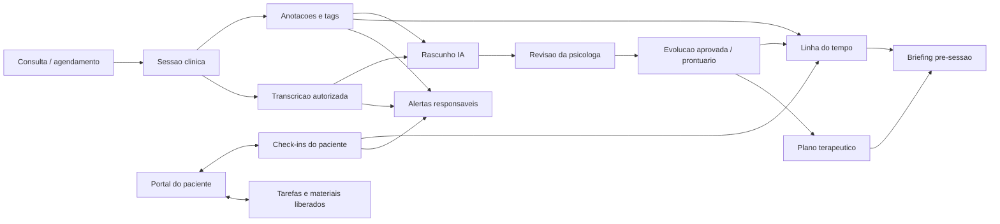
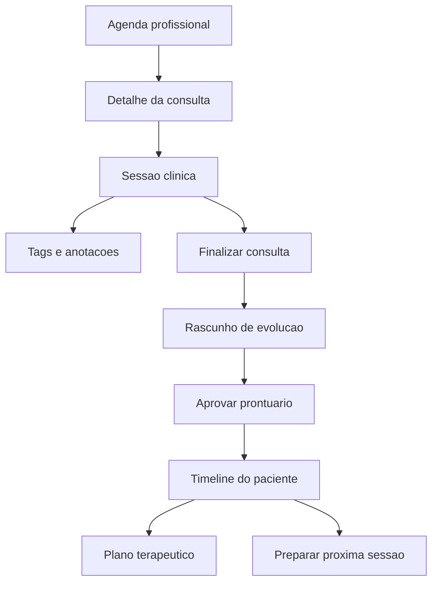
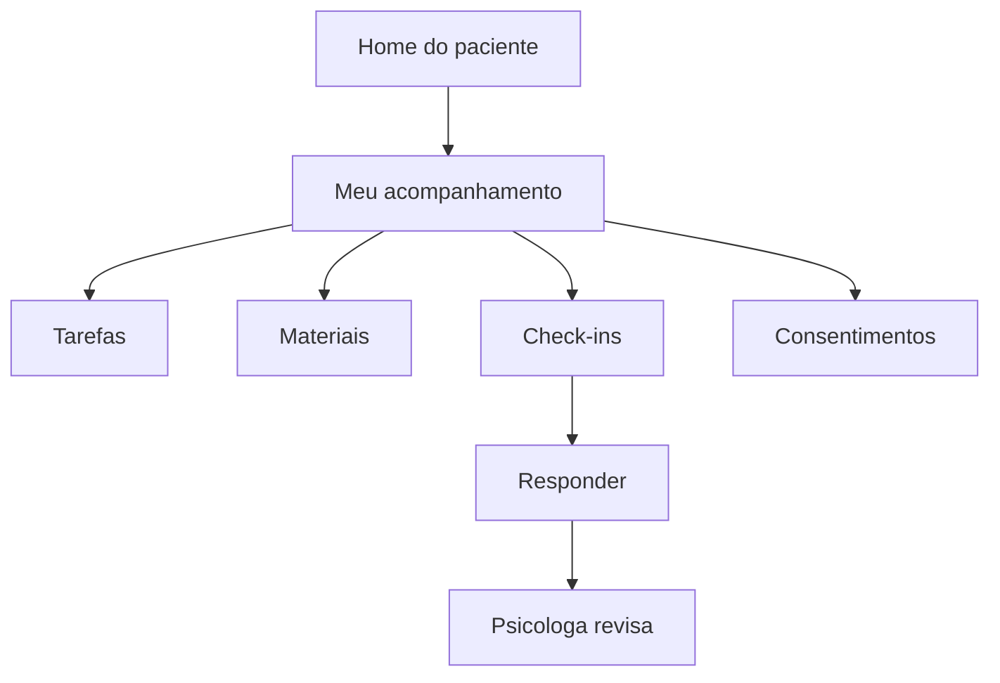

# Especificacao: evolucao clinica, anotacoes e IA para psicologas

Atualizado em 2026-06-24.

Este documento especifica um conjunto de funcionalidades para apoiar o trabalho clinico da psicologa no Psi Agenda Online, com foco em anotacoes, evolucao do paciente, organizacao de sessoes, preparacao de atendimentos, check-ins, portal do paciente, alertas responsaveis e privacidade.

O principio central e:

> A IA ajuda a psicologa a registrar, lembrar, organizar e revisar informacoes. A IA nao diagnostica, nao decide conduta e nao salva conteudo clinico oficial sem revisao humana.

## Contexto do app atual

O sistema atual ja possui:

- App Expo com rotas em `src/app`.
- Telas principais em `src/screens`.
- Cliente HTTP em `src/services/api-client.ts`.
- API ASP.NET Core em `backend/src/PsiAgenda.Api`.
- Banco PostgreSQL via Entity Framework Core.
- Fluxos de autenticacao, agenda, consulta online, profissional, cliente, consultorio e paginas legais.

Em producao, o frontend web usa `https://psi.felicio.app` e a raiz da API e `https://api.felicio.app`. O app nao deve chamar `/api` em `psi.felicio.app` nem acrescentar `/api` ao dominio da API.

## Objetivo do produto

Criar uma camada clinica privada para psicologas, conectada aos pacientes e agendamentos, que permita:

- Registrar evolucao pos-consulta com apoio de IA.
- Marcar pontos importantes ao longo do acompanhamento.
- Visualizar a historia do paciente em linha do tempo.
- Manter plano terapeutico vivo.
- Preparar a proxima sessao automaticamente.
- Separar rascunho, prontuario e memoria clinica.
- Compartilhar apenas conteudo apropriado com o paciente.
- Coletar check-ins entre sessoes.
- Sinalizar possiveis pontos de atencao de forma responsavel.
- Garantir consentimento, sigilo, auditoria e controle de acesso desde o inicio.

## Personas

### Psicologa responsavel

Profissional que atende o paciente e precisa registrar evolucoes, revisar historico, preparar sessoes e acompanhar plano terapeutico.

### Paciente

Pessoa atendida que pode acessar portal, responder check-ins, consultar tarefas combinadas e receber materiais liberados pela psicologa.

### Admin do espaco

Gestor operacional do consultorio. Pode gerenciar agenda e profissionais, mas nao deve acessar conteudo clinico privado sem autorizacao explicita e papel adequado.

### Sistema de IA

Servico auxiliar que processa dados autorizados para gerar rascunhos, resumos, sugestoes e alertas. Nao possui autonomia clinica.

## Principios clinicos e legais

- O conteudo clinico pertence ao contexto profissional e exige sigilo.
- Dados de saude sao dados sensiveis.
- Gravacao, transcricao e analise por IA exigem consentimento explicito e granular.
- A psicologa deve revisar e aprovar qualquer conteudo que entre no prontuario.
- Conteudos gerados por IA devem ser identificaveis como rascunho ou sugestao.
- O paciente nao deve receber analises clinicas automaticas sem revisao humana.
- Acesso, alteracao, exportacao e exclusao devem gerar auditoria.
- O sistema deve permitir revogacao de consentimento para usos futuros.

## Arquitetura conceitual

## Camadas de informacao

### Rascunho

Conteudo editavel, ainda nao oficial. Pode conter texto livre, sugestoes de IA, trechos de transcricao, tags, marcacoes e notas privadas.

### Prontuario

Registro clinico aprovado pela psicologa, com autoria, data, versao e historico de retificacoes.

### Memoria clinica

Lembretes e marcadores usados para continuidade do acompanhamento. Ajuda a psicologa, mas nao equivale automaticamente a documento formal.

### Conteudo compartilhavel

Materiais, tarefas, orientacoes e perguntas que a psicologa decide liberar para o paciente.

## Modelo de permissoes

Papeis sugeridos:

- `patient`: acessa apenas portal, agenda, tarefas, materiais e check-ins proprios.
- `professional`: acessa pacientes e conteudos clinicos vinculados aos seus atendimentos.
- `space_admin`: gerencia operacao do espaco, sem acesso clinico por padrao.
- `clinical_supervisor`: opcional, acesso clinico mediante permissao formal.
- `system_ai`: acesso tecnico temporario e auditado apenas a dados autorizados.

Permissoes sensiveis:

- `clinical_notes:read`
- `clinical_notes:write`
- `clinical_records:approve`
- `clinical_records:rectify`
- `clinical_timeline:read`
- `clinical_plan:manage`
- `patient_portal_content:share`
- `checkins:manage`
- `consents:manage`
- `clinical_exports:create`
- `audit_logs:read`

## Entidades principais sugeridas

### ClinicalSession

Representa a sessao clinica associada ou nao a um agendamento.

Campos principais:

- `id`
- `appointmentId`
- `patientId`
- `professionalId`
- `spaceId`
- `startedAt`
- `endedAt`
- `sessionType`: `online`, `in_person`, `phone`, `other`
- `status`: `scheduled`, `in_progress`, `completed`, `cancelled`, `no_show`
- `createdAt`
- `updatedAt`

### ClinicalDraft

Rascunho de evolucao ou anotacao estruturada.

Campos principais:

- `id`
- `sessionId`
- `patientId`
- `professionalId`
- `source`: `manual`, `tags`, `transcript`, `checkin`, `ai`, `mixed`
- `status`: `draft`, `in_review`, `discarded`, `converted_to_record`
- `recordType`: `session_evolution`, `initial_assessment`, `follow_up`, `rectification`, `other`
- `previousRecordId`: quando o rascunho nasce de uma retificacao
- `contentJson`
- `aiGenerated`: boolean
- `aiModel`
- `createdBy`
- `createdAt`
- `updatedAt`

### ClinicalRecord

Evolucao aprovada no prontuario.

Campos principais:

- `id`
- `sessionId`
- `patientId`
- `professionalId`
- `recordType`: `session_evolution`, `initial_assessment`, `follow_up`, `rectification`, `other`
- `contentJson`
- `contentText`
- `approvedAt`
- `approvedBy`
- `version`
- `previousRecordId`
- `createdAt`
- `updatedAt`

### ClinicalTag

Marcador clinico ou operacional aplicado a sessao, paciente ou item de timeline.

Campos principais:

- `id`
- `spaceId`
- `professionalId`
- `name`
- `category`
- `severity`: `none`, `low`, `medium`, `high`
- `isSystem`
- `isSensitive`
- `color`
- `createdAt`

### PatientTimelineItem

Item exibido na linha do tempo.

Campos principais:

- `id`
- `patientId`
- `professionalId`
- `sourceType`: `session`, `record`, `tag`, `checkin`, `task`, `alert`, `manual_event`, `plan_update`
- `sourceId`
- `occurredAt`
- `title`
- `summary`
- `visibility`: `professional_only`, `shared_with_patient`
- `severity`
- `archived`
- `archivedAt`
- `archivedByUserId`
- `archiveReason`
- `createdAt`

### TreatmentPlan

Plano terapeutico vivo do paciente.

Campos principais:

- `id`
- `patientId`
- `professionalId`
- `status`: `active`, `paused`, `completed`, `archived`
- `caseFormulation`
- `goalsJson`
- `strategiesJson`
- `obstaclesJson`
- `reviewCadence`
- `createdAt`
- `updatedAt`

### PatientConsent

Consentimento granular.

Campos principais:

- `id`
- `patientId`
- `professionalId`
- `consentType`: `recording`, `transcription`, `ai_analysis`, `portal`, `checkins`, `materials`, `notifications`
- `status`: `granted`, `revoked`, `expired`
- `termsVersion`
- `grantedAt`
- `revokedAt`
- `expiresAt`
- `metadataJson`

### AuditLog

Registro de acesso e alteracao.

Campos principais:

- `id`
- `actorUserId`
- `actorRole`
- `action`
- `entityType`
- `entityId`
- `patientId`
- `professionalId`
- `ipAddress`
- `userAgent`
- `createdAt`
- `metadataJson`

## Modulo 1: Registro pos-consulta assistido por IA

### Objetivo

Permitir que a psicologa finalize uma consulta e gere uma evolucao clinica estruturada a partir de anotacoes, tags, check-ins e transcricao autorizada, mantendo revisao humana obrigatoria antes de salvar no prontuario.

### Usuarios envolvidos

- Psicologa responsavel.
- Sistema de IA.
- Paciente, apenas indiretamente via consentimento e atendimento.

### Regras de negocio

1. Toda evolucao gerada por IA deve nascer como `ClinicalDraft`.
2. A IA nao pode criar `ClinicalRecord` diretamente.
3. A psicologa deve revisar e confirmar manualmente antes do conteudo entrar no prontuario.
4. O sistema deve identificar a origem dos dados usados: manual, tags, transcricao, check-in ou misto.
5. O rascunho deve informar que foi gerado ou apoiado por IA quando aplicavel.
6. A evolucao aprovada deve registrar `approvedBy`, `approvedAt`, versao e relacao com a sessao.
7. Alteracoes posteriores em evolucao aprovada devem gerar retificacao ou nova versao, sem apagar historico.
8. O rascunho pode ser descartado sem afetar o prontuario.
9. A psicologa pode criar evolucao manual mesmo sem IA.
10. O sistema deve bloquear uso de transcricao ou IA se o paciente nao tiver consentimento valido para esse uso.

### Estrutura sugerida do rascunho

Campos:

- `resumoObjetivo`
- `temasPrincipais`
- `estadoEmocionalObservado`
- `eventosRelevantes`
- `intervencoesRealizadas`
- `tarefasCombinadas`
- `pontosParaRetomar`
- `observacoesDaPsicologa`
- `alertasParaRevisao`
- `fontesUtilizadas`

### Fluxo principal

1. A consulta muda para `completed`.
2. O app exibe a acao "Criar evolucao".
3. A psicologa escolhe as fontes disponiveis:
   - anotacoes manuais;
   - tags da sessao;
   - respostas de check-in;
   - transcricao, se houver consentimento;
   - conteudo livre digitado naquele momento.
4. O backend valida permissoes e consentimentos.
5. O backend envia dados autorizados ao servico de IA.
6. A IA retorna um rascunho estruturado.
7. O app abre a tela de revisao.
8. A psicologa edita campos, remove sugestoes inadequadas e adiciona observacoes proprias.
9. A psicologa confirma a evolucao.
10. O backend cria `ClinicalRecord`, altera o rascunho para `converted_to_record` e adiciona item na timeline.

### Fluxos alternativos

#### Criar manualmente

1. Psicologa abre a sessao.
2. Seleciona "Escrever evolucao manual".
3. Sistema cria `ClinicalDraft` com `source = manual`.
4. Psicologa preenche e aprova.

#### Descartar sugestao da IA

1. Psicologa visualiza rascunho.
2. Seleciona "Descartar".
3. Sistema marca `ClinicalDraft.status = discarded`.
4. Nenhum item de prontuario e criado.

#### Retificar evolucao

1. Psicologa abre evolucao aprovada.
2. Seleciona "Retificar".
3. Sistema cria novo rascunho com referencia ao registro anterior.
4. Apos aprovacao, cria novo `ClinicalRecord` com `recordType = rectification` e `previousRecordId`.

### Telas necessarias

- Detalhe da consulta profissional: botao "Criar evolucao".
- Tela de rascunho de evolucao.
- Tela de revisao e aprovacao.
- Tela de historico de versoes.
- Modal de descarte.

### APIs sugeridas

- `POST /clinical/sessions/{sessionId}/drafts`
- `POST /clinical/drafts/{draftId}/generate-ai`
- `GET /clinical/drafts/{draftId}`
- `PATCH /clinical/drafts/{draftId}`
- `POST /clinical/drafts/{draftId}/approve`
- `POST /clinical/records/{recordId}/rectifications`
- `GET /clinical/patients/{patientId}/records`

### Conexoes com outros modulos

- Usa tags do Modulo 2.
- Alimenta timeline do Modulo 3.
- Atualiza plano terapeutico no Modulo 4 por sugestao.
- Serve de base para briefing do Modulo 5.
- Respeita separacao de camadas do Modulo 6.
- Pode gerar tarefas compartilhadas no Modulo 7.
- Pode considerar check-ins do Modulo 8.
- Pode disparar alertas revisaveis do Modulo 9.
- Depende de consentimento e auditoria do Modulo 10.

### Criterios de aceite

- Um rascunho gerado por IA nunca aparece como prontuario aprovado.
- Psicologa consegue editar todos os campos antes de aprovar.
- Aprovacao cria registro imutavel versionado.
- Sem consentimento, transcricao e IA nao podem ser usadas.
- Timeline recebe item da evolucao aprovada.
- Auditoria registra criacao, edicao, aprovacao e descarte.

## Modulo 2: Botoes rapidos e tags clinicas

### Objetivo

Permitir que a psicologa marque rapidamente temas, riscos, eventos e pontos de continuidade durante ou apos a sessao, reduzindo carga de escrita e melhorando a qualidade do rascunho posterior.

### Usuarios envolvidos

- Psicologa responsavel.
- Sistema de IA, quando usar tags como contexto.

### Regras de negocio

1. Tags podem ser globais do sistema ou personalizadas pela psicologa.
2. Tags personalizadas pertencem ao profissional ou ao espaco, conforme configuracao.
3. Tags nao substituem evolucao clinica.
4. Tags sensiveis devem ter destaque visual e aparecer em resumo pre-sessao.
5. Cada tag aplicada pode ter nota curta opcional.
6. Tags aplicadas durante uma chamada devem ser privadas para a psicologa.
7. Tags podem ser associadas a uma sessao, paciente, plano, tarefa ou item de timeline.
8. Tags com severidade alta podem gerar alerta pendente de revisao.
9. Tags excluidas da biblioteca nao devem desaparecer do historico; devem ficar arquivadas.
10. O sistema deve permitir filtrar timeline e historico por tag.

### Taxonomia inicial sugerida

Tags de tema:

- `familia`
- `relacionamento`
- `trabalho`
- `estudo`
- `luto`
- `autoestima`
- `ansiedade`
- `humor`
- `sono`
- `alimentacao`
- `rotina`
- `medicacao`

Tags de processo:

- `retomar depois`
- `tarefa combinada`
- `resistencia`
- `insight`
- `mudanca relevante`
- `padrao recorrente`
- `objetivo terapeutico`

Tags sensiveis:

- `crise`
- `risco`
- `ideacao suicida`
- `autolesao`
- `violencia`
- `abuso`
- `uso de substancias`

### Fluxo principal

1. Psicologa abre consulta em andamento ou finalizada.
2. App exibe barra de tags rapidas.
3. Psicologa toca em uma tag.
4. Sistema salva `AppliedClinicalTag`.
5. Opcionalmente, psicologa adiciona nota curta.
6. Tag aparece na sessao e na timeline do paciente.
7. Ao gerar rascunho de evolucao, tags sao incluidas como contexto.

### Fluxo de criacao de tag personalizada

1. Psicologa abre gerenciar tags.
2. Clica em "Nova tag".
3. Define nome, categoria, cor e sensibilidade.
4. Sistema valida duplicidade.
5. Tag fica disponivel nos botoes rapidos.

### Fluxo para tags sensiveis

1. Psicologa aplica tag sensivel.
2. Sistema pede nota opcional e confirma se deve criar lembrete ou alerta.
3. Se severidade alta, cria `ClinicalAlert` pendente.
4. Tag aparece no briefing pre-sessao.

### Entidades adicionais

#### AppliedClinicalTag

- `id`
- `tagId`
- `patientId`
- `professionalId`
- `sessionId`
- `timelineItemId`
- `note`
- `appliedAt`
- `appliedBy`

### Telas necessarias

- Barra de tags na sala online profissional.
- Painel de tags no detalhe da consulta.
- Gerenciamento de tags.
- Filtro por tags na timeline.

### APIs sugeridas

- `GET /clinical/tags`
- `POST /clinical/tags`
- `PATCH /clinical/tags/{tagId}`
- `DELETE /clinical/tags/{tagId}`
- `POST /clinical/sessions/{sessionId}/tags`
- `DELETE /clinical/applied-tags/{appliedTagId}`
- `GET /clinical/patients/{patientId}/tags`

### Conexoes com outros modulos

- Ajuda a gerar evolucao no Modulo 1.
- Cria filtros e eventos na timeline do Modulo 3.
- Pode vincular pontos ao plano terapeutico no Modulo 4.
- Entra no briefing do Modulo 5.
- E classificada como memoria clinica no Modulo 6.
- Pode originar tarefas no portal do Modulo 7.
- Pode comparar com check-ins do Modulo 8.
- Tags sensiveis alimentam alertas do Modulo 9.
- Aplicacao e visualizacao sao auditadas no Modulo 10.

### Criterios de aceite

- Psicologa consegue aplicar tag em ate dois toques.
- Tags aplicadas aparecem na sessao e na timeline.
- Tags sensiveis ficam destacadas.
- Tags arquivadas continuam visiveis no historico.
- IA recebe tags somente quando ha permissao e contexto apropriado.

## Modulo 3: Linha do tempo do paciente

### Objetivo

Oferecer uma visao cronologica, filtravel e clinicamente util da historia do paciente dentro do app, reunindo sessoes, evolucoes, tags, eventos, tarefas, check-ins e alertas.

### Usuarios envolvidos

- Psicologa responsavel.
- Supervisor clinico, se houver permissao.
- Paciente, apenas para itens explicitamente compartilhados em outro contexto.

### Regras de negocio

1. Cada paciente possui timeline privada por relacao clinica com a psicologa.
2. Itens de timeline devem registrar origem e data do evento.
3. A timeline clinica completa nao e visivel para admin operacional.
4. Itens podem ter visibilidade `professional_only` ou `shared_with_patient`.
5. Filtros devem permitir tema, tipo, severidade, data e origem.
6. Itens gerados por IA devem indicar origem quando exibidos.
7. Exclusao de item oficial deve ser restrita; preferir arquivar ou retificar.
8. Itens vindos de prontuario aprovado nao podem ser editados pela timeline.
9. Itens manuais podem ser editados enquanto nao forem convertidos em registro oficial.
10. A timeline deve oferecer resumo recente para preparacao de sessao.

### Tipos de itens

- Sessao agendada.
- Sessao concluida.
- Evolucao aprovada.
- Tag aplicada.
- Evento manual.
- Tarefa combinada.
- Material enviado.
- Check-in respondido.
- Alerta revisado.
- Atualizacao do plano terapeutico.
- Retificacao.

### Fluxo principal

1. Psicologa abre perfil clinico do paciente.
2. Sistema carrega timeline ordenada por data decrescente.
3. Psicologa filtra por periodo, tag, origem ou severidade.
4. Psicologa abre item para ver detalhes.
5. Se permitido, pode adicionar nota privada ou criar acao relacionada.

### Fluxo de evento manual

1. Psicologa clica em "Adicionar evento".
2. Informa data, titulo, resumo, tags e visibilidade.
3. Sistema salva como `manual_event`.
4. Evento passa a compor resumos e briefing.

### Fluxo de busca longitudinal

1. Psicologa pesquisa termo ou tag.
2. Sistema busca em titulos, resumos, tags e registros permitidos.
3. Resultados aparecem agrupados por periodo.
4. Psicologa pode abrir origem completa.

### Telas necessarias

- Perfil clinico do paciente.
- Timeline com filtros.
- Detalhe de item da timeline.
- Criar evento manual.
- Busca no historico.

### APIs sugeridas

- `GET /clinical/patients/{patientId}/timeline`
- `POST /clinical/patients/{patientId}/timeline`
- `GET /clinical/timeline/{itemId}`
- `PATCH /clinical/timeline/{itemId}`
- `POST /clinical/timeline/{itemId}/archive`
- `GET /clinical/patients/{patientId}/timeline/search`

### Conexoes com outros modulos

- Recebe registros do Modulo 1.
- Recebe tags do Modulo 2.
- Mostra marcos do plano terapeutico do Modulo 4.
- E a principal fonte do briefing do Modulo 5.
- Exibe camadas separadas do Modulo 6.
- Pode indicar itens compartilhados no portal do Modulo 7.
- Recebe respostas de check-ins do Modulo 8.
- Exibe alertas revisados do Modulo 9.
- Todas as leituras e mudancas sensiveis usam auditoria do Modulo 10.

### Criterios de aceite

- Timeline mostra sessoes, evolucoes, tags e check-ins do paciente.
- Filtros por data, tag, tipo e severidade funcionam.
- Itens oficiais nao sao editados diretamente.
- Cada item mostra origem.
- Admin operacional nao acessa timeline clinica sem permissao clinica.

## Modulo 4: Plano terapeutico vivo

### Objetivo

Permitir que a psicologa mantenha um plano terapeutico estruturado e atualizado ao longo do acompanhamento, conectando objetivos, estrategias, obstaculos, progresso e sessoes.

### Usuarios envolvidos

- Psicologa responsavel.
- Sistema de IA como auxiliar de sugestoes.
- Paciente, apenas quando a psicologa compartilhar objetivos ou tarefas especificas.

### Regras de negocio

1. Cada paciente pode ter zero, um ou mais planos terapeuticos, mas apenas um plano ativo por relacao clinica.
2. O plano nao e atualizado automaticamente pela IA.
3. Sugestoes da IA devem aparecer como pendentes de revisao.
4. Objetivos devem ter status: `active`, `paused`, `achieved`, `review`, `archived`.
5. Cada objetivo pode ser vinculado a sessoes, tags, tarefas e evolucoes.
6. Mudancas importantes no plano devem gerar item de timeline.
7. O plano deve ter data de revisao sugerida.
8. Conteudo do plano e privado por padrao.
9. A psicologa pode marcar partes como compartilhaveis com o paciente.
10. O plano arquivado fica somente leitura.

### Estrutura sugerida

Campos do plano:

- `demandaInicial`
- `formulacaoClinica`
- `objetivosCurtoPrazo`
- `objetivosLongoPrazo`
- `estrategias`
- `intervencoesPossiveis`
- `obstaculos`
- `fatoresDeProtecao`
- `pontosDeAtencao`
- `tarefasRecorrentes`
- `frequenciaDeRevisao`

Campos de objetivo:

- `id`
- `title`
- `description`
- `status`
- `priority`
- `createdAt`
- `targetReviewDate`
- `linkedTags`
- `linkedRecords`
- `progressNotes`

### Fluxo de criacao

1. Psicologa abre perfil clinico do paciente.
2. Seleciona "Criar plano terapeutico".
3. Preenche demanda inicial, objetivos e estrategias.
4. Define frequencia de revisao.
5. Sistema salva plano ativo.
6. Timeline recebe item "Plano terapeutico criado".

### Fluxo de atualizacao pos-sessao

1. Psicologa aprova evolucao.
2. Sistema identifica objetivos citados ou tags relacionadas.
3. IA sugere possiveis atualizacoes:
   - objetivo teve progresso;
   - objetivo apareceu novamente;
   - objetivo esta sem revisao ha muito tempo;
   - novo obstaculo foi mencionado.
4. Psicologa aceita, edita ou descarta sugestoes.
5. Sistema atualiza plano e registra timeline.

### Fluxo de revisao periodica

1. Plano atinge data de revisao.
2. Sistema exibe lembrete no painel profissional.
3. Psicologa abre revisao.
4. App mostra resumo dos objetivos e evidencias recentes.
5. Psicologa altera status, adiciona notas e define nova data.

### Telas necessarias

- Aba "Plano terapeutico" no perfil clinico.
- Editor de plano.
- Lista de objetivos.
- Revisao periodica.
- Sugestoes pendentes da IA.

### APIs sugeridas

- `GET /clinical/patients/{patientId}/treatment-plan`
- `POST /clinical/patients/{patientId}/treatment-plan`
- `PATCH /clinical/treatment-plans/{planId}`
- `POST /clinical/treatment-plans/{planId}/goals`
- `PATCH /clinical/treatment-goals/{goalId}`
- `POST /clinical/treatment-plans/{planId}/ai-suggestions`
- `POST /clinical/treatment-plan-suggestions/{suggestionId}/accept`
- `POST /clinical/treatment-plan-suggestions/{suggestionId}/dismiss`

### Conexoes com outros modulos

- Usa evolucoes do Modulo 1 como evidencia.
- Usa tags do Modulo 2 para vinculo tematico.
- Exibe alteracoes na timeline do Modulo 3.
- Alimenta briefing pre-sessao do Modulo 5.
- Fica separado do prontuario pelo Modulo 6.
- Pode gerar tarefas compartilhadas no Modulo 7.
- Pode ser acompanhado por check-ins do Modulo 8.
- Pode receber sinalizacoes do Modulo 9.
- Sujeito a consentimento, permissao e auditoria do Modulo 10.

### Criterios de aceite

- Psicologa cria e edita plano ativo.
- Objetivos possuem status e historico.
- Sugestoes de IA nao alteram plano sem aceite.
- Revisoes aparecem na timeline.
- Plano arquivado fica somente leitura.

## Modulo 5: Preparacao automatica para proxima sessao

### Objetivo

Gerar um briefing privado, curto e util antes da consulta, reunindo informacoes recentes e pendencias para ajudar a psicologa a chegar preparada.

### Usuarios envolvidos

- Psicologa responsavel.
- Sistema de IA.

### Regras de negocio

1. Briefing pre-sessao nao e prontuario.
2. Briefing e privado para a psicologa.
3. O sistema deve usar apenas dados que a psicologa tem permissao para acessar.
4. Perguntas sugeridas devem ser neutras e nao indutivas.
5. O briefing deve indicar fontes usadas.
6. A psicologa pode fixar itens para a proxima sessao.
7. Itens sensiveis devem aparecer em area de atencao.
8. O briefing expira ou e arquivado apos a sessao.
9. A psicologa pode converter um ponto do briefing em anotacao ou tarefa.
10. O sistema deve permitir desativar briefing automatico por paciente.

### Conteudo sugerido do briefing

- Ultima sessao em ate cinco linhas.
- Pontos pendentes.
- Tarefas combinadas.
- Check-ins recentes.
- Objetivos terapeuticos relacionados.
- Tags importantes recentes.
- Alertas pendentes.
- Perguntas neutras sugeridas.
- Historico de faltas ou reagendamentos, se clinicamente relevante.

### Fluxo automatico

1. Consulta futura se aproxima.
2. Job do backend identifica sessoes nas proximas 24 horas.
3. Sistema verifica permissoes e configuracao da psicologa.
4. IA sintetiza informacoes recentes.
5. Sistema salva `SessionBriefing`.
6. Psicologa visualiza o briefing no detalhe da consulta ou agenda.

### Fluxo sob demanda

1. Psicologa abre consulta futura.
2. Seleciona "Preparar sessao".
3. Sistema gera briefing com dados atualizados.
4. Psicologa revisa e pode fixar pontos.

### Fluxo pos-sessao

1. Sessao e concluida.
2. Briefing e arquivado automaticamente.
3. Pontos fixados podem ser oferecidos como contexto para rascunho de evolucao.

### Entidade adicional

#### SessionBriefing

- `id`
- `sessionId`
- `patientId`
- `professionalId`
- `contentJson`
- `sourcesJson`
- `status`: `active`, `archived`, `discarded`
- `generatedBy`: `system`, `manual_request`
- `createdAt`
- `archivedAt`

### Telas necessarias

- Card de briefing na agenda profissional.
- Detalhe da consulta futura.
- Painel de pontos fixados.
- Configuracao de briefing automatico.

### APIs sugeridas

- `POST /clinical/sessions/{sessionId}/briefing`
- `GET /clinical/sessions/{sessionId}/briefing`
- `PATCH /clinical/briefings/{briefingId}`
- `POST /clinical/briefings/{briefingId}/archive`
- `POST /clinical/briefings/{briefingId}/pin-item`

### Conexoes com outros modulos

- Resume registros do Modulo 1.
- Destaca tags do Modulo 2.
- Usa timeline do Modulo 3 como fonte principal.
- Exibe objetivos do Modulo 4.
- Respeita separacao do Modulo 6.
- Pode lembrar tarefas do portal do Modulo 7.
- Inclui respostas de check-in do Modulo 8.
- Destaca alertas pendentes do Modulo 9.
- Depende de controles do Modulo 10.

### Criterios de aceite

- Briefing e gerado para consulta futura.
- Psicologa consegue ver fontes.
- Perguntas sugeridas nao aparecem como conclusoes clinicas.
- Briefing nao entra no prontuario.
- Pontos fixados podem ser usados depois na evolucao.

## Modulo 6: Separar rascunho, prontuario e memoria clinica

### Objetivo

Definir uma separacao clara entre conteudos temporarios, registros oficiais e lembretes clinicos, evitando confusao de status e reduzindo risco etico, juridico e operacional.

### Usuarios envolvidos

- Psicologa responsavel.
- Admin tecnico ou suporte, sem acesso a conteudo clinico por padrao.
- Sistema de IA.

### Regras de negocio

1. Todo conteudo clinico deve ter tipo e status claros.
2. Rascunhos sao editaveis e descartaveis.
3. Prontuario aprovado nao deve ser sobrescrito.
4. Alteracoes em prontuario aprovado geram retificacao ou nova versao.
5. Memoria clinica nao deve aparecer como documento formal.
6. Conteudos compartilhaveis precisam de liberacao explicita.
7. Buscas e telas devem mostrar etiquetas visuais: `rascunho`, `prontuario`, `memoria`, `compartilhado`.
8. A IA so pode operar em rascunhos ou sugestoes.
9. Exportacoes devem permitir selecionar quais camadas entram no arquivo.
10. Politicas de retencao podem ser diferentes por camada.

### Estados por camada

Rascunho:

- `draft`
- `in_review`
- `discarded`
- `converted_to_record`

Prontuario:

- `approved`
- `rectified`
- `archived`

Memoria clinica:

- `active`
- `pinned`
- `resolved`
- `archived`

Conteudo compartilhavel:

- `private`
- `pending_share`
- `shared`
- `unshared`

### Fluxo de promocao de rascunho para prontuario

1. Rascunho e criado manualmente ou por IA.
2. Psicologa revisa.
3. Psicologa clica em "Aprovar como evolucao".
4. Sistema valida campos obrigatorios.
5. Sistema cria registro oficial.
6. Rascunho passa a `converted_to_record`.

### Fluxo de memoria clinica

1. Psicologa cria lembrete ou tag.
2. Sistema salva como memoria.
3. Memoria aparece no briefing e timeline.
4. Psicologa pode marcar como resolvida.
5. Memoria resolvida continua no historico.

### Fluxo de compartilhamento

1. Psicologa seleciona item compartilhavel, como tarefa ou material.
2. Sistema mostra previa exata do que o paciente vera.
3. Psicologa confirma.
4. Item muda para `shared`.
5. Paciente recebe acesso no portal.

### Telas necessarias

- Indicadores visuais de camada em todos os itens clinicos.
- Filtros por camada na timeline.
- Tela de exportacao com selecao de camadas.
- Historico de versoes e retificacoes.

### APIs sugeridas

- `GET /clinical/patients/{patientId}/layers`
- `POST /clinical/drafts/{draftId}/convert-to-record`
- `POST /clinical/memory-items`
- `PATCH /clinical/memory-items/{itemId}`
- `POST /clinical/shareable-items/{itemId}/share`
- `POST /clinical/shareable-items/{itemId}/unshare`
- `POST /clinical/patients/{patientId}/exports`

### Conexoes com outros modulos

- Estrutura o rascunho e prontuario do Modulo 1.
- Classifica tags do Modulo 2 como memoria.
- Organiza exibicao da timeline do Modulo 3.
- Diferencia plano terapeutico de prontuario no Modulo 4.
- Define briefing como conteudo temporario no Modulo 5.
- Controla o que pode ir ao portal no Modulo 7.
- Classifica check-ins como entrada do paciente no Modulo 8.
- Classifica alertas como sugestoes revisaveis no Modulo 9.
- Apoia auditoria e consentimento do Modulo 10.

### Criterios de aceite

- Usuario sempre ve se um item e rascunho, prontuario, memoria ou compartilhado.
- Rascunho pode ser descartado sem afetar prontuario.
- Registro aprovado nao e sobrescrito.
- Retificacao preserva historico.
- Paciente so ve itens explicitamente compartilhados.

## Modulo 7: Portal do paciente com cuidado

### Objetivo

Oferecer ao paciente um espaco seguro para acessar agenda, tarefas combinadas, materiais liberados, check-ins e comunicacoes, sem expor evolucoes clinicas privadas ou analises automaticas.

### Usuarios envolvidos

- Paciente.
- Psicologa responsavel.
- Sistema de notificacoes.

### Regras de negocio

1. Paciente nao acessa prontuario clinico completo por padrao.
2. Paciente acessa apenas conteudos explicitamente compartilhados.
3. Conteudo gerado por IA nao pode ser compartilhado sem revisao humana.
4. Tarefas e materiais podem ter prazo, status e comentarios.
5. Psicologa pode remover compartilhamento de um item.
6. Paciente pode responder tarefas e check-ins.
7. Respostas do paciente entram como insumo clinico privado para a psicologa.
8. Portal deve respeitar consentimentos e preferencias de notificacao.
9. Paciente deve ver quando algo foi enviado pela psicologa.
10. O portal deve evitar linguagem de diagnostico automatico.

### Conteudos do portal

- Proximas consultas.
- Link de sala online quando consulta confirmada.
- Historico de consultas visivel ao paciente.
- Tarefas combinadas.
- Materiais enviados.
- Check-ins pendentes.
- Orientacoes praticas liberadas.
- Termos, consentimentos e preferencias.

### Fluxo de envio de tarefa

1. Psicologa cria tarefa no contexto da sessao, plano ou paciente.
2. Define titulo, descricao, prazo e se aceita resposta.
3. Marca como compartilhavel.
4. Sistema exibe previa.
5. Psicologa confirma envio.
6. Paciente recebe notificacao.
7. Paciente visualiza e marca como feita ou responde.
8. Resposta aparece para a psicologa.

### Fluxo de envio de material

1. Psicologa seleciona arquivo, link ou texto.
2. Define nome, descricao e paciente.
3. Confirma compartilhamento.
4. Paciente acessa no portal.
5. Sistema registra visualizacao se permitido.

### Fluxo do paciente

1. Paciente entra no app.
2. Abre area "Meu acompanhamento".
3. Ve tarefas, materiais e check-ins.
4. Responde ou conclui itens.
5. Psicologa recebe status no perfil clinico.

### Entidades adicionais

#### PatientTask

- `id`
- `patientId`
- `professionalId`
- `sessionId`
- `treatmentGoalId`
- `title`
- `description`
- `dueAt`
- `status`: `assigned`, `viewed`, `completed`, `skipped`, `archived`
- `sharedAt`
- `completedAt`

#### SharedMaterial

- `id`
- `patientId`
- `professionalId`
- `title`
- `description`
- `url`
- `fileId`
- `status`: `shared`, `unshared`, `archived`
- `sharedAt`

### Telas necessarias

- Area "Meu acompanhamento" para paciente.
- Tarefas do paciente.
- Materiais do paciente.
- Configuracoes de consentimento e notificacao.
- Painel da psicologa com status das tarefas.

### APIs sugeridas

- `GET /patients/me/care`
- `GET /patients/me/tasks`
- `POST /patients/me/tasks/{taskId}/complete`
- `GET /patients/me/materials`
- `POST /clinical/patients/{patientId}/tasks`
- `PATCH /clinical/tasks/{taskId}`
- `POST /clinical/tasks/{taskId}/share`
- `POST /clinical/materials`
- `POST /clinical/materials/{materialId}/share`

### Conexoes com outros modulos

- Pode receber tarefas derivadas de evolucao do Modulo 1.
- Pode usar tags do Modulo 2 para organizar tarefas internamente.
- Itens compartilhados aparecem na timeline do Modulo 3.
- Tarefas podem se vincular ao plano do Modulo 4.
- Briefing do Modulo 5 mostra tarefas pendentes.
- Usa camadas do Modulo 6 para controlar visibilidade.
- E o canal principal para check-ins do Modulo 8.
- Respostas sensiveis podem gerar alerta do Modulo 9.
- Depende fortemente de consentimento, logs e permissao do Modulo 10.

### Criterios de aceite

- Paciente ve apenas itens compartilhados.
- Psicologa ve previa antes de compartilhar.
- Tarefa enviada aparece para paciente e psicologa.
- Paciente consegue concluir ou responder tarefa.
- Conteudo clinico privado nao aparece no portal.

## Modulo 8: Check-ins entre sessoes

### Objetivo

Permitir que a psicologa colete informacoes breves entre sessoes, como humor, ansiedade, sono, eventos importantes e cumprimento de tarefas, para apoiar continuidade do acompanhamento.

### Usuarios envolvidos

- Psicologa responsavel.
- Paciente.
- Sistema de IA para resumo de tendencias.

### Regras de negocio

1. Check-ins devem ser opcionais e configuraveis por paciente.
2. Ativacao exige consentimento do paciente.
3. Psicologa define frequencia, perguntas e periodo ativo.
4. Paciente pode pular uma resposta.
5. Check-in nao substitui atendimento.
6. Respostas devem aparecer como insumo, nao como conclusao clinica.
7. Respostas de risco podem gerar alerta pendente.
8. Escalas devem manter consistencia para permitir grafico longitudinal.
9. Psicologa pode pausar check-ins.
10. Paciente pode revogar consentimento para novos check-ins.

### Tipos de pergunta

- Escala numerica de 0 a 10.
- Multipla escolha.
- Sim/nao.
- Texto curto.
- Seletor de humor.
- Confirmacao de tarefa.

### Templates iniciais

Check-in semanal:

- "Como foi seu nivel de ansiedade desde a ultima sessao?"
- "Como esteve seu humor predominante?"
- "Como foi seu sono?"
- "Aconteceu algo importante que voce gostaria de registrar?"
- "Voce conseguiu realizar a tarefa combinada?"

Check-in de tarefa:

- "Voce conseguiu praticar a atividade combinada?"
- "O que facilitou ou dificultou?"

Check-in de crise, com muito cuidado:

- "Voce gostaria que sua psicologa soubesse de algum ponto urgente antes da proxima sessao?"

### Fluxo de configuracao

1. Psicologa abre paciente.
2. Seleciona "Configurar check-in".
3. Escolhe template ou cria perguntas.
4. Define frequencia, horario e duracao.
5. Sistema verifica consentimento.
6. Se necessario, solicita aceite do paciente.
7. Check-in fica ativo.

### Fluxo de resposta

1. Paciente recebe notificacao.
2. Abre check-in no portal.
3. Responde perguntas.
4. Sistema salva `CheckinResponse`.
5. Psicologa visualiza no painel e na timeline.
6. Se houver criterio de atencao, sistema cria alerta revisavel.

### Fluxo de resumo por IA

1. Psicologa abre pre-sessao ou timeline.
2. Sistema envia respostas autorizadas para IA.
3. IA gera resumo de tendencia, por exemplo:
   - ansiedade subiu nas ultimas 3 respostas;
   - sono piorou;
   - tarefa foi concluida duas vezes seguidas.
4. Psicologa revisa como informacao auxiliar.

### Entidades adicionais

#### CheckinTemplate

- `id`
- `professionalId`
- `name`
- `questionsJson`
- `isSystem`
- `createdAt`

#### PatientCheckinSchedule

- `id`
- `patientId`
- `professionalId`
- `templateId`
- `frequency`
- `sendTime`
- `status`: `active`, `paused`, `ended`
- `startsAt`
- `endsAt`

#### CheckinResponse

- `id`
- `scheduleId`
- `patientId`
- `answersJson`
- `submittedAt`
- `riskFlag`
- `createdAt`

### Telas necessarias

- Configurar check-in no perfil clinico.
- Responder check-in no portal.
- Grafico de respostas ao longo do tempo.
- Resumo de tendencias.
- Lista de check-ins pendentes.

### APIs sugeridas

- `GET /clinical/checkin-templates`
- `POST /clinical/checkin-templates`
- `POST /clinical/patients/{patientId}/checkin-schedules`
- `PATCH /clinical/checkin-schedules/{scheduleId}`
- `GET /patients/me/checkins`
- `POST /patients/me/checkins/{checkinId}/responses`
- `GET /clinical/patients/{patientId}/checkin-responses`
- `POST /clinical/patients/{patientId}/checkin-summary`

### Conexoes com outros modulos

- Pode ser usado como fonte no rascunho do Modulo 1.
- Pode sugerir tags do Modulo 2.
- Respostas entram na timeline do Modulo 3.
- Indicadores podem se vincular ao plano do Modulo 4.
- Briefing do Modulo 5 mostra respostas recentes.
- Respostas sao entrada do paciente na camada do Modulo 6.
- Portal do Modulo 7 e a interface principal.
- Pode disparar alertas responsaveis do Modulo 9.
- Exige consentimento e auditoria do Modulo 10.

### Criterios de aceite

- Psicologa configura check-in por paciente.
- Paciente responde pelo portal.
- Respostas aparecem para psicologa.
- Grafico longitudinal funciona para escalas.
- Resposta de risco gera alerta revisavel, nao acao automatica invasiva.

## Modulo 9: Alertas responsaveis

### Objetivo

Sinalizar possiveis pontos de atencao clinica ou operacional a partir de tags, transcricoes autorizadas, anotacoes e check-ins, sempre como alerta revisavel pela psicologa e nunca como diagnostico automatico.

### Usuarios envolvidos

- Psicologa responsavel.
- Sistema de IA.
- Paciente, apenas indiretamente quando sua resposta gera sinalizacao.

### Regras de negocio

1. Alerta nao e diagnostico.
2. Todo alerta deve exibir motivo, origem e nivel.
3. Alerta deve ter status: `pending`, `confirmed`, `dismissed`, `monitoring`, `resolved`.
4. Psicologa decide o que fazer com o alerta.
5. Alertas nao devem enviar mensagem automatica ao paciente sem configuracao explicita e revisao.
6. Linguagem deve ser neutra: "possivel ponto de atencao" em vez de conclusoes fechadas.
7. Alertas de severidade alta devem aparecer no briefing e painel.
8. Falsos positivos descartados devem ser registrados para melhorar regras futuras.
9. Alertas devem respeitar consentimentos de origem.
10. Alertas nao devem ser visiveis para admin operacional.

### Niveis de alerta

- `baixo`: revisar quando possivel.
- `medio`: destacar no proximo atendimento.
- `alto`: revisar com prioridade pela psicologa.

### Fontes de alerta

- Tag sensivel aplicada pela psicologa.
- Resposta de check-in.
- Padrao longitudinal em escalas.
- Transcricao autorizada.
- Anotacao manual.
- Mudanca brusca em engajamento ou faltas.

### Exemplos de alerta responsavel

Formato recomendado:

- Titulo: "Possivel ponto de atencao: desesperanca"
- Nivel: `medio`
- Origem: "Check-in de 2026-06-22"
- Motivo: "Paciente mencionou desesperanca em resposta aberta."
- Acao: "Revisar antes da proxima sessao."

Formato a evitar:

- "Paciente esta em risco."
- "Diagnostico detectado."
- "Conduta recomendada obrigatoria."

### Fluxo principal

1. Sistema recebe entrada autorizada.
2. Motor de regras ou IA identifica possivel ponto de atencao.
3. Backend cria `ClinicalAlert` com status `pending`.
4. Psicologa visualiza alerta no painel, timeline ou briefing.
5. Psicologa abre detalhes e decide:
   - confirmar;
   - descartar;
   - acompanhar;
   - resolver;
   - criar nota/tarefa.
6. Decisao gera auditoria e item de timeline, quando adequado.

### Fluxo de alerta por check-in

1. Paciente responde texto livre ou escala.
2. Regra detecta palavra/frase sensivel ou variacao de escala.
3. Sistema cria alerta.
4. Psicologa recebe destaque no painel.
5. Nenhuma mensagem automatica e enviada sem regra configurada.

### Fluxo de alerta por tag

1. Psicologa aplica tag `risco` ou `crise`.
2. Sistema sugere criar alerta.
3. Psicologa confirma ou ignora.
4. Alerta entra no briefing da proxima sessao.

### Entidade adicional

#### ClinicalAlert

- `id`
- `patientId`
- `professionalId`
- `sessionId`
- `sourceType`
- `sourceId`
- `title`
- `description`
- `severity`
- `status`
- `reasonJson`
- `reviewedAt`
- `reviewedBy`
- `createdAt`
- `updatedAt`

### Telas necessarias

- Painel de alertas da psicologa.
- Alertas no perfil clinico.
- Alertas no briefing pre-sessao.
- Detalhe do alerta com origem e acoes.

### APIs sugeridas

- `GET /clinical/alerts`
- `GET /clinical/patients/{patientId}/alerts`
- `POST /clinical/alerts`
- `PATCH /clinical/alerts/{alertId}`
- `POST /clinical/alerts/{alertId}/confirm`
- `POST /clinical/alerts/{alertId}/dismiss`
- `POST /clinical/alerts/{alertId}/resolve`

### Conexoes com outros modulos

- Pode ser gerado durante rascunho do Modulo 1.
- Pode nascer de tags do Modulo 2.
- Aparece na timeline do Modulo 3.
- Pode impactar pontos de atencao do plano no Modulo 4.
- Deve aparecer no briefing do Modulo 5.
- E sugestao revisavel na camada do Modulo 6.
- Pode vir de respostas no portal do Modulo 7.
- Pode vir de check-ins do Modulo 8.
- Depende integralmente de privacidade, consentimento e auditoria do Modulo 10.

### Criterios de aceite

- Alerta sempre mostra fonte e motivo.
- Psicologa consegue confirmar, descartar, acompanhar ou resolver.
- Alertas nao aparecem para paciente ou admin operacional.
- Nenhum alerta gera diagnostico automatico.
- Alerta alto aparece no briefing e painel.

## Modulo 10: Privacidade e seguranca desde o comeco

### Objetivo

Garantir que dados clinicos, gravacoes, transcricoes, IA, portal, check-ins, auditoria e exportacoes respeitem sigilo, consentimento granular, controle de acesso e boas praticas de seguranca.

### Usuarios envolvidos

- Paciente.
- Psicologa responsavel.
- Admin do espaco, com acesso limitado.
- Suporte tecnico, idealmente sem acesso ao conteudo.
- Sistema de IA.

### Regras de negocio

1. Consentimento deve ser granular por finalidade.
2. O paciente pode consentir portal e recusar gravacao, por exemplo.
3. Revogacao vale para processamentos futuros.
4. Antes de gravar, transcrever ou usar IA, o sistema deve validar consentimento.
5. Conteudo clinico deve ser criptografado em transito e em repouso.
6. Visualizacao, criacao, alteracao, exportacao e exclusao devem gerar auditoria.
7. Acesso clinico deve ser limitado por vinculo profissional-paciente.
8. Admin operacional nao acessa prontuario por padrao.
9. Exportacoes devem exigir confirmacao e registrar motivo.
10. O sistema deve ter politica de retencao e descarte.
11. Logs tecnicos nao devem conter conteudo clinico sensivel.
12. Chaves, tokens e URLs assinadas devem ter tempo de expiracao.
13. Backups devem seguir a mesma protecao dos dados principais.
14. A integracao com IA deve minimizar dados enviados.
15. Quando possivel, dados enviados a IA devem ser reduzidos ao necessario para a tarefa.

### Consentimentos granulares

Tipos:

- Uso do portal do paciente.
- Recebimento de notificacoes.
- Check-ins entre sessoes.
- Gravacao de chamada.
- Transcricao de chamada.
- Analise por IA de anotacoes.
- Analise por IA de transcricoes.
- Compartilhamento de materiais.
- Uso de dados para melhoria do servico, se existir.

### Fluxo de consentimento inicial

1. Psicologa habilita recurso que exige consentimento.
2. Sistema identifica consentimento ausente.
3. Paciente recebe termo claro.
4. Paciente aceita ou recusa cada finalidade.
5. Sistema registra versao do termo, data, IP e usuario.
6. Recurso fica disponivel apenas para finalidades aceitas.

### Fluxo antes de gravar consulta

1. Psicologa tenta iniciar gravacao.
2. Sistema verifica consentimento `recording`.
3. Se nao houver consentimento, bloqueia e oferece solicitar aceite.
4. Se houver consentimento, mostra aviso de gravacao.
5. Gravacao inicia.
6. Auditoria registra inicio e fim.

### Fluxo antes de IA

1. Psicologa solicita rascunho, resumo ou alerta por IA.
2. Backend verifica consentimento aplicavel:
   - `ai_analysis` para anotacoes;
   - `transcription` e `ai_analysis` para transcricao.
3. Backend filtra dados ao minimo necessario.
4. Solicita IA.
5. Salva resultado como sugestao ou rascunho.
6. Registra auditoria.

### Fluxo de revogacao

1. Paciente acessa consentimentos no portal ou solicita a psicologa.
2. Revoga finalidade especifica.
3. Sistema registra `revokedAt`.
4. Novos processamentos daquela finalidade sao bloqueados.
5. Conteudos ja aprovados seguem politica definida e base legal aplicavel.

### Fluxo de auditoria

1. Usuario acessa conteudo clinico.
2. Backend grava evento com entidade, acao, usuario e horario.
3. Eventos sensiveis podem ser consultados por perfil autorizado.
4. Exportacoes e visualizacoes de prontuario recebem destaque.

### Controles tecnicos sugeridos

- Criptografia TLS para trafego.
- Criptografia em repouso para campos sensiveis.
- Segregacao de dados clinicos e operacionais.
- URLs assinadas para arquivos clinicos.
- Politica de logs sem corpo de prontuario.
- Rate limit em endpoints clinicos.
- Sessao com refresh token seguro.
- Autenticacao forte para profissionais.
- Verificacao de ownership em todos os endpoints clinicos.
- Jobs de limpeza para rascunhos temporarios, conforme politica.

### Telas necessarias

- Central de consentimentos do paciente.
- Configuracoes clinicas da psicologa.
- Aviso de gravacao/transcricao.
- Historico de consentimentos.
- Painel de auditoria autorizado.
- Confirmacao de exportacao.

### APIs sugeridas

- `GET /patients/me/consents`
- `POST /patients/me/consents`
- `POST /patients/me/consents/{consentId}/revoke`
- `GET /clinical/patients/{patientId}/consents`
- `POST /clinical/patients/{patientId}/request-consent`
- `GET /audit/clinical`
- `POST /clinical/patients/{patientId}/exports`
- `GET /clinical/security/policies`

### Conexoes com outros modulos

- Bloqueia ou libera IA do Modulo 1.
- Controla uso de tags sensiveis do Modulo 2.
- Protege timeline do Modulo 3.
- Protege plano do Modulo 4.
- Protege briefing do Modulo 5.
- Sustenta separacao de camadas do Modulo 6.
- Define visibilidade do portal do Modulo 7.
- Controla check-ins do Modulo 8.
- Audita alertas do Modulo 9.

### Criterios de aceite

- Sistema impede gravacao sem consentimento valido.
- Sistema impede IA sobre transcricao sem consentimento valido.
- Paciente consegue ver e revogar consentimentos.
- Todo acesso a prontuario gera auditoria.
- Admin operacional nao acessa conteudo clinico por padrao.
- Exportacao gera log e exige confirmacao.

## Integracao geral no app

### Status da integracao inicial

Esta primeira entrega criou uma integracao vertical fina no app Expo. A segunda entrega adicionou persistencia clinica inicial no backend para rascunhos, tags e timeline. A terceira entrega adicionou aprovacao manual de rascunho como prontuario. A integracao ainda nao possui IA real, gravacao ou transcricao.

Atualizacao da segunda entrega: a integracao deixou de ser apenas visual para os primeiros modulos. O backend agora possui persistencia inicial para rascunhos clinicos, tags aplicadas e itens de timeline vinculados ao atendimento.

Atualizacao da terceira entrega: o backend agora possui `ClinicalRecord`, endpoint de aprovacao humana de rascunho e exibicao do prontuario aprovado no workspace clinico. Ainda nao existe IA, consentimento granular, portal, check-ins, alertas, retificacao, exportacao ou gravacao/transcricao.

Atualizacao da quarta entrega: o backend agora possui `PatientConsent`, consentimentos granulares por paciente/profissional, endpoint de atualizacao por atendimento e exibicao dos consentimentos no workspace clinico. Ainda nao existe portal do paciente para consentimento direto, IA, check-ins, alertas, retificacao, exportacao ou gravacao/transcricao.

Atualizacao da quinta entrega: o backend agora possui `ClinicalSession` vinculada ao agendamento, cria a sessao clinica ao abrir o workspace, permite iniciar/finalizar a sessao pelo fluxo da psicologa e registra memoria/auditoria dessas transicoes. Ainda nao existe portal do paciente, plano terapeutico persistido, check-ins, alertas, IA, retificacao, exportacao ou gravacao/transcricao.

Atualizacao da sexta entrega: o backend agora permite criar rascunho de retificacao a partir de `ClinicalRecord` aprovado por `POST /clinical/records/{recordId}/rectifications`. A aprovacao desse rascunho cria uma nova versao com `recordType = rectification` e `previousRecordId`, sem sobrescrever a evolucao anterior. Ainda nao existe portal do paciente, plano terapeutico persistido, check-ins, alertas, IA, exportacao ou gravacao/transcricao.

Atualizacao da setima entrega: o backend agora possui `TreatmentPlan` persistido por paciente/profissional, exibido no workspace clinico e atualizado por `POST /clinical/appointments/{appointmentId}/treatment-plan`. A atualizacao cria memoria na timeline e auditoria sem copiar formulacao, objetivos ou estrategias para metadata. Ainda nao existe historico versionado do plano, portal do paciente, check-ins, alertas, IA, exportacao ou gravacao/transcricao.

Atualizacao da oitava entrega: o backend agora possui `PatientTask` e `SharedMaterial`, exibidos no workspace clinico e criados como conteudo privado por `POST /clinical/appointments/{appointmentId}/tasks` e `POST /clinical/appointments/{appointmentId}/materials`. O compartilhamento e o recolhimento sao acoes explicitas da psicologa, exigem consentimento ativo quando aplicavel e registram timeline/auditoria sem copiar conteudo clinico sensivel para metadata. Ainda nao existe area do paciente para consumir tarefas/materiais, check-ins, alertas, IA, exportacao ou gravacao/transcricao.

Atualizacao da nona entrega: o paciente agora possui a area "Meu acompanhamento" em `/patient-care`, alimentada por `GET /patients/me/care`. Esse endpoint retorna apenas `PatientTask` compartilhada/concluida e `SharedMaterial` com `status = shared`, validando consentimento ativo de portal e, para materiais, consentimento de materiais. A rota nao retorna rascunhos, prontuarios, tags privadas, plano terapeutico ou timeline interna. Ainda nao existe resposta/conclusao de tarefa pelo paciente, consentimento direto pelo portal, check-ins, alertas, IA, exportacao ou gravacao/transcricao.

Atualizacao da decima entrega: o paciente agora pode concluir uma tarefa compartilhada por `POST /patients/me/tasks/{taskId}/complete`, enviando uma resposta opcional quando a tarefa aceita resposta. A conclusao muda a tarefa para `completed`, registra `responseText`, `responseSubmittedAt` e `completedAt`, e cria memoria/timeline privada para revisao da psicologa sem copiar a resposta para metadata de auditoria. Ainda nao existe consentimento direto pelo portal, reabertura/edicao de tarefa, check-ins, alertas, IA, exportacao ou gravacao/transcricao.

Atualizacao da decima primeira entrega: o paciente agora ve consentimentos do proprio acompanhamento em `/patient-care` e pode conceder ou revogar diretamente `portal`, `materials`, `checkins` e `notifications` por `POST /patients/me/consents/{professionalId}/{consentType}`. O backend valida conta de paciente ativa, vinculo por atendimento com a profissional e bloqueia consentimentos sensiveis (`ai_analysis`, `recording`, `transcription`) nesse fluxo simples. A atualizacao cria memoria/timeline e auditoria sem copiar conteudo clinico para metadata. Ainda nao existe fluxo especifico para consentimentos sensiveis de IA, gravacao ou transcricao, reabertura/edicao de tarefa, check-ins, alertas, exportacao ou gravacao/transcricao.

Atualizacao da decima segunda entrega: o backend agora possui `PatientCheckIn`, persistido por paciente/profissional e criado como privado por `POST /clinical/appointments/{appointmentId}/check-ins`. A psicologa pode compartilhar ou recolher check-ins por endpoints explicitos, com validacao de consentimentos `portal` e `checkins`. O paciente ve check-ins compartilhados em `/patient-care` e responde por `POST /patients/me/check-ins/{checkInId}/respond`, usando escala de 1 a 5 e observacao opcional. A resposta cria memoria privada para revisao da psicologa e auditoria sem copiar a resposta para metadata. Ainda nao existe agenda recorrente de check-ins, templates editaveis, graficos longitudinais, alertas, IA, exportacao ou gravacao/transcricao.

Atualizacao da decima terceira entrega: a timeline clinica ganhou consulta longitudinal por paciente em `GET /clinical/patients/{patientId}/timeline`, restrita a profissional vinculada por atendimento nao expirado/rejeitado. O endpoint aceita filtros de camada, origem, periodo, busca textual e limite, retornando eventos reais de sessao, rascunhos, prontuario, tags, consentimentos, plano, tarefas, materiais e check-ins quando existirem. A tela clinica passou a ter busca e chips de filtro, mostrando vazio real quando nenhum evento corresponde, sem expor timeline interna no portal do paciente. A auditoria da consulta nao grava termo de busca nem conteudo clinico em metadata. Ainda nao existe detalhe/arquivamento de item da timeline, filtro por tag aplicada/severidade, alertas, IA, exportacao ou gravacao/transcricao.

Atualizacao da decima quarta entrega: a timeline agora possui detalhe auditado em `GET /clinical/timeline/{itemId}`. A rota valida profissional vinculada ao paciente, retorna o item, dados operacionais do atendimento e metadados seguros da origem, como status, tipo e versao quando aplicavel, sem copiar `ContentText` de rascunho/prontuario, resposta livre de paciente ou conteudo clinico sensivel para fora do modulo correto. A tela clinica permite abrir o detalhe a partir de eventos reais e mostra nota de acesso por camada. A auditoria usa `clinical.timeline_item.viewed` sem metadata sensivel. Ainda nao existe arquivamento controlado de itens nao oficiais, filtro por tag aplicada/severidade, alertas, IA, exportacao ou gravacao/transcricao.

Atualizacao da decima quinta entrega: a timeline agora permite arquivar item nao oficial por `POST /clinical/timeline/{itemId}/archive`, com motivo opcional e auditoria `clinical.timeline_item.archived` sem metadata sensivel. Itens arquivados saem da timeline ativa e do workspace, mas permanecem preservados para detalhe e rastreabilidade. Itens de prontuario aprovado continuam bloqueados para arquivamento pela timeline e devem seguir por retificacao formal. Ainda nao existe filtro por tag aplicada/severidade, alertas, IA, exportacao ou gravacao/transcricao.

Atualizacao da decima sexta entrega: a consulta longitudinal da timeline passou a aceitar filtros `tag` e `severity` em `GET /clinical/patients/{patientId}/timeline`, usando `AppliedClinicalTag` do atendimento para selecionar eventos associados a uma tag ou ao tom clinico `neutral`, `attention` ou `risk`. A tela clinica ganhou chips de tag aplicada e severidade no painel de filtros, preservando loading, vazio real e erro sem registrar esses parametros em metadata de auditoria. Ainda nao existem eventos reais de alertas, IA, exportacao ou gravacao/transcricao.

Atualizacao da decima setima entrega: o backend agora possui `ClinicalAlert`, criado manualmente por atendimento em `POST /clinical/appointments/{appointmentId}/alerts`, listado por paciente em `GET /clinical/patients/{patientId}/alerts` e revisado por acoes humanas de confirmar, acompanhar, descartar ou resolver. O workspace clinico exibe um painel compacto de alertas responsaveis, registra timeline/auditoria sem conteudo clinico sensivel em metadata e reforca que alerta nao e diagnostico nem dispara mensagem automatica ao paciente. Ainda nao existe motor automatico de alertas por tags/check-ins, destaque de alerta alto no briefing, IA, exportacao ou gravacao/transcricao.

Atualizacao da decima oitava entrega: o briefing da proxima sessao no workspace clinico deixou de ser apenas conceitual e passou a usar dados reais ja carregados no atendimento: alertas ativos, tarefas, check-ins, tags aplicadas e objetivos do plano terapeutico. Alertas ativos de severidade `alto` aparecem em uma area de atencao prioritaria, com linguagem neutra, sem diagnostico automatico, sem prontuario e sem notificar o paciente. Ainda nao existe entidade `SessionBriefing` persistida, job automatico, itens fixados, IA, exportacao ou gravacao/transcricao.

Atualizacao da decima nona entrega: o backend agora possui um motor inicial de alertas responsaveis por regras seguras. Tags clinicas com tom `risk` criam ou reutilizam alerta pendente de severidade `alto` por atendimento, e respostas de check-in com escala 1 ou 2 criam alerta pendente `alto` ou `medio` vinculado a resposta. A regra nao usa IA, nao diagnostica, nao envia mensagem automatica ao paciente, nao cria prontuario e audita a criacao sem metadata sensivel. Ainda nao existe configuracao visual das regras, agenda recorrente de check-ins, graficos longitudinais, aprendizado de falso positivo, IA, exportacao ou gravacao/transcricao.

Atualizacao da vigesima entrega: o backend agora exporta prontuarios aprovados por paciente em `GET /clinical/patients/{patientId}/records/export`, validando vinculo profissional-paciente e retornando somente `ClinicalRecord` com `status = approved`. A exportacao inclui aviso de escopo, texto consolidado e metadados das versoes aprovadas, deixando fora rascunhos, memoria clinica, alertas, check-ins, tarefas, materiais compartilhaveis e timeline interna. A consulta gera auditoria `clinical.records.exported` sem gravar conteudo clinico em metadata. A tela clinica ganhou painel de exportacao aprovada com resultado selecionavel. Ainda nao existe exportacao seletiva de outras camadas, politica completa de retencao, matriz formal de permissoes, IA, gravacao ou transcricao.

Atualizacao da vigesima primeira entrega: o workspace clinico agora devolve `ClinicalAccessPolicy`, uma matriz efetiva de permissoes calculada a partir do papel profissional, vinculo paciente-profissional e consentimentos granulares. A UI exibe o que esta liberado ou bloqueado, separando permissoes por vinculo clinico, portal/check-ins/materiais e capacidades sensiveis de IA, gravacao e transcricao. IA, gravacao e transcricao continuam bloqueadas sem consentimento sensivel ativo e a matriz nao inclui conteudo clinico em metadata de auditoria. Ainda nao existe fluxo juridicamente revisado para captar consentimentos sensiveis, politica completa de retencao, IA real, gravacao ou transcricao.

Atualizacao da vigesima segunda entrega: consentimentos sensiveis agora seguem fluxo proprio. A psicologa solicita `ai_analysis`, `recording` ou `transcription` pelo workspace clinico, o paciente decide no portal em uma area separada de consentimentos sensiveis, e o backend bloqueia tentativa de marcar esses consentimentos como concedidos diretamente pela profissional. A solicitacao e a decisao geram timeline/auditoria sem conteudo clinico sensivel. Ainda nao existe revisao juridica final dos textos, historico completo de versoes do termo, IA real, gravacao ou transcricao.

Atualizacao da vigesima terceira entrega: o backend agora possui `PatientConsentEvent`, trilha tecnica imutavel para solicitacoes, concessoes, revogacoes, expiracoes e versoes de termos de cada `PatientConsent`, incluindo backfill de estado inicial para consentimentos ja existentes. O workspace clinico e o portal do paciente exibem historico compacto de consentimentos sem conteudo clinico sensivel, reforcando rastreabilidade antes de IA, gravacao ou transcricao. Ainda nao existe revisao juridica final dos textos, politica formal de retencao/revogacao, criptografia de campos sensiveis, IA real, gravacao ou transcricao.

Atualizacao da vigesima quarta entrega: o backend agora possui `PatientConsentTerm`, catalogo versionado de termos ativos por tipo de consentimento. Atualizacoes de consentimento validam que a versao informada existe e esta ativa; quando a versao nao e enviada, a API usa a versao ativa do tipo. Workspace clinico e portal do paciente devolvem `consentTerms` e exibem resumo, politica de retencao e aviso de revisao juridica, sem permitir IA, gravacao ou transcricao sem consentimento ativo. Ainda falta revisao juridica final dos textos, politica operacional completa de retencao/revogacao, criptografia de campos sensiveis, IA real, gravacao e transcricao.

Atualizacao da vigesima quinta entrega: consentimentos concedidos com `expiresAt` vencido agora sao materializados como `expired` quando o workspace clinico ou o portal do paciente carregam o relacionamento. Essa transicao cria `PatientConsentEvent`, memoria na timeline e auditoria segura `clinical.consent.expired`, mantendo permissao, portal, materiais, check-ins, IA, gravacao e transcricao bloqueados apos o prazo. Ainda faltam jobs agendados dedicados, politica operacional completa de retencao/revogacao, revisao juridica final dos textos, criptografia de campos sensiveis, IA real, gravacao e transcricao.

Atualizacao da vigesima sexta entrega: a API agora registra `ClinicalConsentExpirationWorker`, um job dedicado que expira consentimentos vencidos em segundo plano e tambem roda ao subir a aplicacao. O job reutiliza a trilha `PatientConsentEvent`, cria memoria na timeline, audita `clinical.consent.expired` com `UserId` nulo para indicar execucao de sistema e usa indice por `status`/`expiresAt` para varrer apenas consentimentos candidatos. Ainda faltam politica operacional completa de retencao/revogacao, revisao juridica final dos textos, criptografia de campos sensiveis, IA real, gravacao e transcricao.

Atualizacao da vigesima setima entrega: a UI/UX dos fluxos centrais foi refinada para seguir a linguagem visual atual da home do paciente, com paleta azul discreta, tipografia mais compacta, cards de 6-8px, menor sombra e separacao visual mais clara entre cuidado, agenda, gestor e workspace clinico. A home do paciente agora evita horario ficticio quando nao ha proxima consulta e usa estado de acao principal real para encontrar psicologa. Este ciclo nao adicionou IA, gravacao, transcricao ou novas permissoes sensiveis. Ainda faltam politica operacional completa de retencao/revogacao, revisao juridica final dos textos, criptografia de campos sensiveis, telas legadas fora deste escopo com pesos/radii antigos, IA real, gravacao e transcricao.

Atualizacao da vigesima oitava entrega: workspace clinico e portal do paciente agora recebem `retentionPolicies`, uma politica operacional calculada por vinculo profissional/espaco, tipo de consentimento, status e versao de termo. A UI exibe uso atual liberado ou bloqueado, efeito da revogacao, efeito da expiracao automatica, validade e texto de retencao sem misturar essa politica com prontuario, rascunho, memoria clinica ou conteudo compartilhavel. A revogacao e a expiracao seguem bloqueando novos usos de portal, materiais, check-ins, IA, gravacao e transcricao, preservando apenas eventos tecnicos para rastreabilidade e auditoria sem conteudo clinico sensivel. Ainda faltam revisao juridica final dos textos, criptografia de campos sensiveis, politicas avancadas por papel/supervisao, IA real, gravacao e transcricao.

Atualizacao da vigesima nona entrega: a matriz `ClinicalAccessPolicy` agora inclui limites calculados por papel (`roleBoundaries`) e guardrails de governanca (`guardrails`) derivados do vinculo profissional-paciente, consentimentos atuais e historico tecnico de revogacoes/expiracoes. A UI do workspace clinico foi refinada como painel de governanca animado, separando papel da psicologa vinculada, bloqueio do admin operacional, supervisao clinica ainda pendente de designacao formal, escopo do paciente e sistema de IA limitado a consentimento/minimizacao. Esse incremento nao libera novo acesso clinico: ele documenta e exibe bloqueios antes de IA, gravacao, transcricao ou supervisao real. Ainda faltam revisao juridica final dos textos, criptografia de campos sensiveis, papel real de supervisao clinica com escopo/auditoria propria, IA real, gravacao e transcricao.

Atualizacao da trigesima entrega: os novos textos clinicos sensiveis passaram a ser protegidos em repouso por envelope `enc:v1` com AES-256-GCM no backend, mantendo leitura transparente de registros legados ainda em texto puro. `ClinicalDraft`, `ClinicalRecord`, notas de tags, formulacao de caso, tarefas, materiais, check-ins e alertas agora gravam os campos textuais protegidos, e uma migration amplia essas colunas para `text` para evitar estouro do envelope cifrado. Workspace clinico e portal do paciente recebem `dataProtection` e exibem um painel discreto animado de protecao dos dados, sem expor conteudo clinico, IA, gravacao ou transcricao. Ainda faltam configurar chave definitiva fora do fallback de desenvolvimento, definir rotacao de chaves, migrar legado ja armazenado e cobrir o contrato de protecao com testes automatizados.

Atualizacao da trigesima primeira entrega: o painel web da psicologa foi redesenhado para seguir a linguagem visual atual da home do paciente, com shell operacional compacto, sidebar clara, cards baixos, agenda em lista, checklist de publicacao, avisos de sigilo e acoes rapidas. A tela agora separa indicadores administrativos de conteudo clinico privado, evita expor rascunho/prontuario/memoria no painel operacional e usa animacoes discretas de entrada/layout com Reanimated. Este ciclo nao adicionou IA, gravacao, transcricao, novas permissoes clinicas ou acesso do admin operacional a conteudo privado. Ainda faltam testes visuais automatizados, ajustes finos em telas legadas fora do painel e evoluir as pendencias clinicas ja listadas.

Atualizacao da trigesima segunda entrega: `GET /clinical/patients/{patientId}/alerts` agora aceita filtros de severidade, status, origem, somente ativos e limite. O workspace clinico ganhou painel compacto de triagem de alertas responsaveis, com chips e animacao discreta, para priorizar revisao humana sem diagnostico automatico, sem envio de mensagem ao paciente e sem metadata sensivel na auditoria. Ainda faltam configuracao visual das regras, aprendizado de falso positivo, tendencias longitudinais, politica especifica de retencao/exportacao para alertas, IA, gravacao e transcricao.

Arquivos criados ou alterados:

- `src/app/patient-care.tsx`
- `src/screens/ClinicalScreens.tsx`
- `src/screens/HomeScreen.tsx`
- `src/screens/PatientCareScreen.tsx`
- `src/app/clinical-integration.tsx`
- `src/app/clinical-patient.tsx`
- `src/types/clinical.ts`
- `src/data/clinical-integration.ts`
- `src/screens/OwnerScreens.tsx`
- `src/screens/ProfessionalScreens.tsx`
- `src/services/api-client.ts`
- `backend/src/PsiAgenda.Application/Clinical/ClinicalContracts.cs`
- `backend/src/PsiAgenda.Domain/Entities/ClinicalSession.cs`
- `backend/src/PsiAgenda.Domain/Entities/ClinicalDraft.cs`
- `backend/src/PsiAgenda.Domain/Entities/ClinicalRecord.cs`
- `backend/src/PsiAgenda.Domain/Entities/AppliedClinicalTag.cs`
- `backend/src/PsiAgenda.Domain/Entities/PatientTimelineItem.cs`
- `backend/src/PsiAgenda.Domain/Entities/PatientConsent.cs`
- `backend/src/PsiAgenda.Domain/Entities/TreatmentPlan.cs`
- `backend/src/PsiAgenda.Domain/Entities/PatientTask.cs`
- `backend/src/PsiAgenda.Domain/Entities/SharedMaterial.cs`
- `backend/src/PsiAgenda.Domain/Entities/PatientCheckIn.cs`
- `backend/src/PsiAgenda.Domain/Entities/ClinicalAlert.cs`
- `backend/src/PsiAgenda.Infrastructure/Services/ClinicalService.cs`
- `backend/src/PsiAgenda.Infrastructure/Services/ClinicalConsentExpirationWorker.cs`
- `backend/src/PsiAgenda.Infrastructure/Services/IClinicalTextProtector.cs`
- `backend/src/PsiAgenda.Infrastructure/Services/ClinicalTextProtector.cs`
- `backend/src/PsiAgenda.Infrastructure/Services/ClinicalDataProtectionOptions.cs`
- `backend/src/PsiAgenda.Api/Endpoints/ClinicalEndpoints.cs`
- `backend/src/PsiAgenda.Infrastructure/Persistence/Migrations/20260623013000_AddClinicalWorkspaceTables.cs`
- `backend/src/PsiAgenda.Infrastructure/Persistence/Migrations/20260623020000_AddClinicalRecords.cs`
- `backend/src/PsiAgenda.Infrastructure/Persistence/Migrations/20260623033000_AddPatientConsents.cs`
- `backend/src/PsiAgenda.Infrastructure/Persistence/Migrations/20260623040000_AddClinicalSessions.cs`
- `backend/src/PsiAgenda.Infrastructure/Persistence/Migrations/20260623043000_AddClinicalDraftRectifications.cs`
- `backend/src/PsiAgenda.Infrastructure/Persistence/Migrations/20260623050000_AddTreatmentPlans.cs`
- `backend/src/PsiAgenda.Infrastructure/Persistence/Migrations/20260623053000_AddPatientShareables.cs`
- `backend/src/PsiAgenda.Infrastructure/Persistence/Migrations/20260623060000_AddPatientTaskResponses.cs`
- `backend/src/PsiAgenda.Infrastructure/Persistence/Migrations/20260623063000_AddPatientCheckIns.cs`
- `backend/src/PsiAgenda.Infrastructure/Persistence/Migrations/20260623070000_AddTimelineItemArchiving.cs`
- `backend/src/PsiAgenda.Infrastructure/Persistence/Migrations/20260623073000_AddClinicalAlerts.cs`
- `backend/src/PsiAgenda.Infrastructure/Persistence/Migrations/20260623085000_AddPatientConsentExpirationIndex.cs`
- `backend/src/PsiAgenda.Infrastructure/Persistence/Migrations/20260624042000_WidenClinicalProtectedTextFields.cs`
- `backend/src/PsiAgenda.Infrastructure/Persistence/PsiAgendaDbContext.cs`
- `backend/src/PsiAgenda.Infrastructure/DependencyInjection.cs`
- `backend/src/PsiAgenda.Api/Program.cs`

Feito agora:

1. A agenda da psicologa ganhou o botao "Integracao clinica".
2. Cada atendimento da agenda profissional ganhou o botao "Acompanhamento clinico".
3. A rota `/clinical-integration` mostra o status dos 10 modulos, separando feito e falta.
4. A rota `/clinical-patient` abre o espaco clinico inicial do atendimento.
5. A tela clinica busca o detalhe real do atendimento profissional por `GET /professionals/me/appointments/{appointmentId}` quando existe `appointmentId`.
6. A tela clinica carrega o workspace clinico por `GET /clinical/appointments/{appointmentId}/workspace`.
7. Tags rapidas podem ser salvas por `POST /clinical/appointments/{appointmentId}/tags`.
8. Rascunhos manuais podem ser salvos por `POST /clinical/appointments/{appointmentId}/drafts`.
9. O backend criou `ClinicalDraft`, `AppliedClinicalTag` e `PatientTimelineItem`.
10. A migration `20260623013000_AddClinicalWorkspaceTables` cria as tabelas clinicas iniciais.
11. O backend criou `ClinicalRecord` para evolucao aprovada manualmente.
12. A migration `20260623020000_AddClinicalRecords` cria a tabela de prontuario aprovado.
13. Rascunhos podem ser aprovados por `POST /clinical/drafts/{draftId}/approve`.
14. A aprovacao marca o rascunho como `converted_to_record`, cria item de timeline com camada `prontuario` e gera auditoria.
15. Acoes clinicas geram `AuditLog` sem incluir conteudo clinico sensivel no `metadata_json`.
16. Endpoints clinicos validam que a profissional autenticada esta vinculada ao atendimento antes de ler ou salvar dados.
17. A linha do tempo mostra itens reais quando existirem e usa preview apenas como fallback.
18. O app continua deixando claro que rascunho nao e prontuario ate aprovacao humana.
19. A entrada no fluxo parte da tela que a psicologa ja usa, evitando uma area isolada.
20. Consentimentos granulares sao listados no workspace por atendimento.
21. Consentimentos podem ser registrados como concedidos, revogados, pendentes ou expirados no backend.
22. Atualizacao de consentimento cria item de memoria na timeline e auditoria sem conteudo clinico sensivel.
23. `ClinicalSession` e criada a partir do atendimento e exibida no workspace.
24. Psicologa pode iniciar e finalizar a sessao clinica sem gerar prontuario automaticamente.
25. Inicio e finalizacao da sessao geram memoria na timeline e auditoria sem conteudo clinico sensivel.
26. Prontuario aprovado pode gerar rascunho de retificacao sem alterar o registro original.
27. Aprovacao de retificacao cria nova versao do prontuario com referencia ao registro anterior.
28. Retificacao cria timeline e auditoria sem incluir conteudo clinico sensivel no metadata.
29. `TreatmentPlan` e persistido por paciente/profissional e carregado no workspace clinico.
30. Plano terapeutico pode ser atualizado pela psicologa com status, formulacao, objetivos, estrategias, pontos de atencao e cadencia de revisao.
31. Atualizacao do plano cria item de memoria e auditoria sem armazenar conteudo clinico sensivel no metadata.
32. `PatientTask` e `SharedMaterial` sao persistidos por paciente/profissional e carregados no workspace clinico.
33. Psicologa pode criar tarefa e material como conteudo privado, com previa do que o paciente vera antes de compartilhar.
34. Psicologa pode compartilhar ou recolher tarefas e materiais por endpoints explicitos.
35. Compartilhamento de tarefa exige consentimento ativo para portal; compartilhamento de material exige consentimento ativo para portal e materiais.
36. Criacao, compartilhamento e recolhimento entram na timeline com camadas `memoria` ou `compartilhado` e auditoria sem conteudo clinico no metadata.
37. Paciente acessa `/patient-care` a partir da home e ve apenas tarefas e materiais ja compartilhados.
38. `GET /patients/me/care` filtra conteudo por paciente autenticado, status compartilhado e consentimentos ativos.
39. Portal do paciente nao retorna rascunho, prontuario, memoria interna, tags privadas nem plano terapeutico.
40. Paciente pode concluir tarefa compartilhada por `POST /patients/me/tasks/{taskId}/complete`.
41. Resposta opcional de tarefa fica visivel para paciente e psicologa, mas nao entra em metadata de auditoria.
42. Conclusao de tarefa cria memoria privada na timeline para revisao da psicologa.
43. `GET /patients/me/care` retorna consentimentos nao sensiveis do acompanhamento do paciente.
44. Paciente pode conceder ou revogar `portal`, `materials`, `checkins` e `notifications` por `POST /patients/me/consents/{professionalId}/{consentType}`.
45. O portal bloqueia consentimentos sensiveis de IA, gravacao e transcricao nesse fluxo direto.
46. Atualizacao de consentimento pelo paciente cria memoria e auditoria sem conteudo clinico sensivel no metadata.
47. `PatientCheckIn` e persistido por paciente/profissional e carregado no workspace clinico.
48. Psicologa pode criar check-in privado, revisar a previa e compartilhar ou recolher por endpoints explicitos.
49. Compartilhar check-in exige consentimento ativo para portal e check-ins.
50. Paciente pode responder check-in compartilhado por `POST /patients/me/check-ins/{checkInId}/respond`.
51. Resposta de check-in cria memoria privada na timeline e auditoria sem armazenar resposta no metadata.
52. Psicologa pode consultar timeline longitudinal por paciente em `GET /clinical/patients/{patientId}/timeline`.
53. A consulta longitudinal valida vinculo paciente-profissional por atendimento ativo antes de retornar itens.
54. Timeline aceita filtros por camada, origem, periodo, busca textual e limite seguro.
55. Tela clinica ganhou painel de filtros e estados de loading, vazio real e erro para timeline.
56. Visual da timeline foi refinado para separar rascunho, prontuario, memoria e compartilhado com chips e cards compactos.
57. Psicologa pode abrir detalhe auditado de item por `GET /clinical/timeline/{itemId}`.
58. Detalhe valida vinculo profissional-paciente antes de retornar qualquer dado.
59. Detalhe retorna metadados seguros da origem sem expor texto de prontuario, rascunho ou respostas livres.
60. A tela clinica exibe nota de acesso por camada e registra loading/erro do detalhe.
61. Psicologa pode arquivar item nao oficial por `POST /clinical/timeline/{itemId}/archive`.
62. Arquivamento bloqueia itens de prontuario aprovado e orienta usar retificacao formal.
63. Itens arquivados saem da timeline ativa, mas ficam preservados para detalhe auditado e rastreabilidade.
64. A tela clinica exibe acao de arquivamento no detalhe com motivo opcional, loading, erro e sucesso.
65. Timeline longitudinal aceita filtros `tag` e `severity` sem incluir esses parametros em metadata de auditoria.
66. Backend filtra eventos por `AppliedClinicalTag` do atendimento, respeitando o vinculo profissional-paciente.
67. A tela clinica exibe chips compactos para tag aplicada e severidade junto aos filtros existentes.
68. `ClinicalAlert` foi criado como entidade de alerta responsavel com fonte, motivo, severidade, status e revisao humana.
69. Psicologa pode registrar alerta manual por atendimento com severidade `baixo`, `medio` ou `alto`.
70. Workspace clinico lista alertas do paciente/profissional e separa estados pendentes, confirmados, em acompanhamento, descartados e resolvidos.
71. Psicologa pode confirmar, acompanhar, descartar ou resolver alerta por endpoints explicitos.
72. Criacao e revisao de alerta criam itens de timeline na camada `memoria`, com linguagem neutra e sem diagnostico automatico.
73. Auditoria de alertas usa metadata segura sem copiar motivo ou conteudo clinico sensivel.
74. A UI reforca que alerta nao notifica o paciente e nao substitui julgamento clinico.
75. Briefing da proxima sessao usa dados reais do workspace clinico: alertas ativos, tarefas, check-ins, tags e plano.
76. Alertas ativos de severidade `alto` aparecem em area de atencao prioritaria no briefing.
77. Briefing exibe fontes e perguntas neutras sem IA, sem prontuario e sem mensagem automatica ao paciente.
78. O status do modulo de preparacao foi atualizado para deixar claro que ainda faltam job automatico, persistencia e itens fixados.
79. Tags clinicas com tom `risk` criam alerta responsavel pendente de severidade `alto`, deduplicado por atendimento enquanto nao for descartado ou resolvido.
80. Respostas de check-in com escala 1 ou 2 criam alerta responsavel pendente de severidade `alto` ou `medio`, deduplicado por check-in respondido.
81. Alertas por regra criam memoria na timeline e auditoria `clinical.alert.rule_created` sem copiar resposta, nota ou conteudo clinico para metadata.
82. A UI identifica alertas originados de resposta de check-in com label clinico claro.
83. Psicologa pode exportar prontuarios aprovados por `GET /clinical/patients/{patientId}/records/export`.
84. Exportacao valida vinculo profissional-paciente, retorna somente `ClinicalRecord` aprovado e exclui rascunho, memoria, alertas, check-ins, tarefas, materiais e timeline interna.
85. Exportacao cria auditoria `clinical.records.exported` sem armazenar conteudo clinico no metadata.
86. A tela clinica mostra painel de exportacao aprovada com texto selecionavel e aviso de escopo.
87. Workspace clinico retorna `ClinicalAccessPolicy` com papel, vinculo profissional-paciente e lista de permissoes efetivas.
88. Permissoes de portal, materiais e check-ins sao liberadas somente quando os consentimentos aplicaveis estao ativos.
89. Permissoes sensiveis de IA, gravacao e transcricao aparecem bloqueadas ate consentimento especifico ativo.
90. Tela clinica exibe matriz de permissoes sem misturar rascunho, prontuario, memoria ou conteudo compartilhavel.
91. Psicologa solicita consentimentos sensiveis por `POST /clinical/appointments/{appointmentId}/sensitive-consents/request`.
92. Portal do paciente lista pedidos sensiveis separadamente e permite conceder ou recusar cada finalidade.
93. Backend bloqueia concessao direta de `ai_analysis`, `recording` e `transcription` pela profissional.
94. Solicitar ou decidir consentimento sensivel cria timeline e auditoria sem conteudo clinico sensivel.
95. `PatientConsentEvent` preserva historico tecnico de acao, estado final, versao de termos e timestamps sem copiar conteudo clinico.
96. Workspace clinico e portal do paciente exibem historico recente de consentimentos separado do prontuario, rascunho, memoria clinica e conteudo compartilhavel.
97. `PatientConsentTerm` versiona termos ativos por tipo de consentimento e identifica quais finalidades sao sensiveis.
98. Backend rejeita atualizacao de consentimento com versao de termo inexistente ou inativa.
99. Workspace clinico e portal do paciente exibem resumo, politica de retencao e aviso de revisao juridica do termo ativo.
100. Consentimentos concedidos com `expiresAt` vencido sao materializados como `expired` antes de calcular permissoes ou conteudo visivel.
101. Expiracao cria evento tecnico, memoria na timeline e auditoria segura sem metadata clinica sensivel.
102. `ClinicalConsentExpirationWorker` executa expiracao dedicada em segundo plano e ao subir a API.
103. Consulta de expiracao ganhou indice por `status` e `expiresAt`.
104. Workspace clinico e portal do paciente retornam politica operacional de retencao/revogacao por consentimento e vinculo.
105. UI da psicologa e do paciente exibem efeito de revogacao/expiracao e bloqueio de novos usos sem expor conteudo clinico sensivel.
106. Workspace clinico retorna limites por papel e guardrails de governanca sem liberar acesso novo para admin operacional ou supervisao.
107. UI da psicologa exibe governanca de acesso com separacao entre papeis, guardrails e permissoes efetivas, com animacoes discretas.
108. Novos campos textuais clinicos sensiveis sao protegidos em repouso por envelope `enc:v1` e continuam legiveis nos DTOs por descriptografia transparente.
109. Workspace clinico e portal do paciente retornam `dataProtection`, informando algoritmo, origem da chave, campos protegidos e aviso de rotacao sem incluir conteudo clinico.
110. UI da psicologa e do paciente exibe protecao de dados clinicos com linguagem discreta, icone de cadeado e animacao curta alinhada ao padrao visual atual.
111. Painel web da psicologa foi reestruturado como mesa operacional compacta, com sidebar, acao principal, agenda, checklist, avisos e atalhos coerentes com a home do paciente.
112. Indicadores administrativos do consultorio agora ficam separados de qualquer rascunho, prontuario, memoria clinica ou conteudo compartilhavel.
113. Tela do painel da psicologa usa icones mais claros e animacoes discretas de entrada/layout para reduzir sensacao de prototipo cru no modo web.

Falta para virar produto clinico real:

1. Revisar juridicamente textos e versoes dos termos sensiveis de IA, gravacao e transcricao.
2. Ampliar exportacao seletiva para outros cenarios permitidos e formalizar politica de retencao.
3. Implementar papel real de supervisao clinica com escopo do paciente, aprovacao formal e auditoria propria.
4. Criar reabertura/edicao de tarefas, materiais completos e agenda recorrente de check-ins.
5. Conectar IA somente depois de consentimento e minimizacao de dados.
6. Revisar juridicamente a politica de retencao/revogacao exibida e formalizar procedimentos operacionais fora do app.
7. Refinar alertas responsaveis com configuracao de regras, aprendizagem de falso positivo e tendencias longitudinais.
8. Adicionar testes de contrato da API e testes de tela.
9. Ajustar copy legal/clinica com revisao profissional.
10. Configurar chave produtiva de `ClinicalDataProtection`, definir rotacao, migrar registros legados e testar o envelope cifrado.

Status por modulo:

| Modulo | Status atual | Feito | Falta |
| --- | --- | --- | --- |
| Registro pos-consulta com IA | Parcial | `ClinicalSession`, `ClinicalDraft` manual, `ClinicalRecord` aprovado manualmente, retificacao versionada por atendimento e exportacao auditada de prontuarios aprovados | IA e edicao assistida |
| Botoes rapidos e tags clinicas | Parcial | Tags salvas em `AppliedClinicalTag` por atendimento; historico longitudinal filtra por tag aplicada | Biblioteca de tags e personalizacao |
| Linha do tempo do paciente | Parcial | `PatientTimelineItem` criado para sessao, rascunhos, tags, consentimentos, plano, tarefas, materiais, check-ins e alertas revisados; `GET /clinical/patients/{patientId}/timeline` com filtros de camada, origem, periodo, busca, tag, severidade e limite; detalhe auditado por `GET /clinical/timeline/{itemId}`; arquivamento controlado por `POST /clinical/timeline/{itemId}/archive`; UI com vazio/loading/erro; alertas por regra entram como memoria privada; alertas do paciente filtram por severidade, status, origem e somente ativos | Politicas de retencao/exportacao para alertas e timeline |
| Plano terapeutico vivo | Parcial | `TreatmentPlan` persistido e editavel no workspace clinico | Historico versionado, revisao periodica e sugestoes por IA |
| Preparacao da proxima sessao | Parcial | Briefing no workspace usa fontes reais ja carregadas: alertas ativos, tarefas, check-ins, tags e plano; alertas altos aparecem em area prioritaria; perguntas neutras nao viram prontuario | `SessionBriefing` persistido, job automatico, itens fixados, arquivamento e IA somente com consentimento |
| Separar rascunho, prontuario e memoria | Parcial | Rascunho, memoria, prontuario aprovado e retificacao versionada aparecem como camadas separadas; exportacao aprovada exclui rascunhos, memoria, alertas, check-ins e compartilhaveis | Exportacao seletiva de outras camadas e politicas de retencao |
| Portal do paciente com cuidado | Parcial | Tarefas, materiais e check-ins privados no workspace; previa antes de compartilhar; share/unshare com consentimento; `/patient-care` para itens liberados, conclusao/resposta de tarefa, resposta de check-in e consentimento direto nao sensivel | Reabertura/edicao de tarefas, historico de visualizacao e refinamento de materiais |
| Check-ins entre sessoes | Parcial | `PatientCheckIn` persistido, compartilhamento com consentimento e resposta pelo portal com escala/observacao | Agenda recorrente, templates editaveis, graficos e tendencias |
| Alertas responsaveis | Parcial | `ClinicalAlert`, criacao manual por atendimento, motor inicial por tags `risk` e check-ins com escala 1 ou 2, painel no workspace com triagem por severidade/status/origem, acoes de confirmar/acompanhar/descartar/resolver, timeline, auditoria sem mensagem automatica ao paciente e destaque de alerta alto no briefing | Configuracao de regras, aprendizado de falso positivo e tendencias longitudinais |
| Privacidade e seguranca | Parcial | Rotas autenticadas, validacao profissional-atendimento, `PatientConsent` persistido, `PatientConsentEvent` com historico tecnico/versionado, `PatientConsentTerm` com catalogo versionado e validacao de versao ativa, politica operacional de retencao/revogacao calculada no workspace e portal, expiracao materializada por `expiresAt`, job dedicado de expiracao, shareables com consentimento, consentimento direto nao sensivel no portal, solicitacao/decisao de consentimentos sensiveis, exportacao aprovada auditada, matriz efetiva de permissoes com limites por papel/guardrails, protecao em repouso dos novos textos clinicos sensiveis com envelope `enc:v1` e auditoria sem conteudo clinico | Revisao juridica dos textos sensiveis, formalizacao operacional fora do app, papel real de supervisao clinica, chave produtiva/rotacao e migracao dos registros legados |

### Navegacao profissional sugerida

Adicionar uma area clinica dentro da experiencia da psicologa:

- Agenda profissional.
- Detalhe da consulta.
- Perfil clinico do paciente.
- Linha do tempo.
- Evolucoes.
- Plano terapeutico.
- Tarefas e materiais.
- Check-ins.
- Alertas.
- Consentimentos.

Fluxo principal:

### Navegacao do paciente sugerida

Adicionar area "Meu acompanhamento":

- Proximas consultas.
- Tarefas.
- Materiais.
- Check-ins.
- Consentimentos.

Fluxo principal:

### Integracao com consulta online

Na tela de video chamada profissional:

- Exibir painel lateral ou aba recolhivel de tags.
- Permitir anotacao privada.
- Mostrar consentimento de gravacao/transcricao.
- Botao de iniciar/parar gravacao, quando implementado.
- Ao encerrar, oferecer criacao de rascunho.

Na tela do paciente:

- Mostrar aviso claro quando gravacao estiver ativa.
- Oferecer acesso a consentimentos.
- Nao mostrar tags ou notas privadas.

### Integracao com backend

Criar um bounded context clinico dentro da API:

- `ClinicalSessions`
- `ClinicalDrafts`
- `ClinicalRecords`
- `ClinicalTags`
- `PatientTimeline`
- `TreatmentPlans`
- `PatientTasks`
- `SharedMaterials`
- `Checkins`
- `ClinicalAlerts`
- `PatientConsents`
- `PatientConsentEvents`
- `PatientConsentTerms`
- `ClinicalAuditLogs`

Endpoints devem sempre validar:

- usuario autenticado;
- papel e permissoes;
- vinculo profissional-paciente;
- consentimento quando aplicavel;
- status da entidade;
- auditoria de acesso.

### Integracao com IA

Criar um servico de aplicacao, por exemplo `ClinicalAiService`, com operacoes:

- gerar rascunho de evolucao;
- resumir timeline;
- sugerir atualizacao de plano;
- gerar briefing;
- resumir check-ins;
- identificar possiveis alertas.

Cada chamada deve receber:

- finalidade;
- paciente;
- profissional;
- fontes permitidas;
- prompt versionado;
- politica de minimizacao de dados;
- registro de auditoria.

### Estados e origem de conteudo

Todos os conteudos gerados ou apoiados por IA devem manter metadados:

- `aiGenerated`
- `aiModel`
- `promptVersion`
- `sourceIds`
- `generatedAt`
- `reviewedBy`
- `reviewedAt`

## Roadmap de implementacao

### Fase 1: nucleo clinico sem gravacao

Entregar primeiro:

- Entidades de sessao clinica, rascunho, prontuario, tags e timeline.
- Anotacoes manuais pos-consulta.
- Tags rapidas.
- Evolucao manual e aprovacao.
- Timeline do paciente.
- Auditoria basica.

Motivo:

- Gera valor imediato.
- Evita comecar pela parte mais sensivel.
- Cria fundacao para IA depois.

### Fase 2: IA em rascunhos e briefing

Entregar:

- Geracao de rascunho por IA a partir de anotacoes e tags.
- Briefing pre-sessao.
- Metadados de IA.
- Revisao humana obrigatoria.
- Consentimento para analise por IA.

### Fase 3: plano terapeutico e tarefas

Entregar:

- Plano terapeutico vivo.
- Sugestoes pendentes de atualizacao.
- Tarefas compartilhaveis.
- Portal basico do paciente.

### Fase 4: check-ins

Entregar:

- Templates de check-in.
- Agenda de envio.
- Respostas no portal.
- Graficos simples.
- Resumo de tendencias.

### Fase 5: alertas responsaveis

Entregar:

- Motor inicial de alertas por tags e check-ins.
- Painel de alertas.
- Filtros de triagem por severidade, status, origem e somente ativos.
- Fluxo de confirmar, descartar, acompanhar e resolver.
- Auditoria detalhada.

### Fase 6: gravacao, transcricao e analise

Entregar por ultimo:

- Consentimento especifico para gravacao.
- Gravacao de chamada.
- Transcricao.
- Rascunho de evolucao a partir de transcricao.
- Politica de retencao e exclusao.

Motivo:

- Maior sensibilidade legal e etica.
- Exige experiencia transparente para paciente.
- Exige infraestrutura de armazenamento e seguranca mais robusta.

## Prioridade tecnica sugerida

1. Modelagem de permissoes clinicas.
2. Consentimento granular.
3. Auditoria.
4. Sessao clinica vinculada ao agendamento.
5. Rascunho e prontuario versionado.
6. Tags.
7. Timeline.
8. Plano terapeutico.
9. Portal do paciente.
10. Check-ins.
11. Protecao em repouso, chave produtiva, rotacao e migracao de legado.
12. Alertas.
13. IA para rascunho e briefing.
14. Gravacao e transcricao.

## Questoes em aberto

1. O app tera um unico prontuario por paciente ou prontuario por vinculo paciente-profissional?
2. Admin do espaco podera ver algum dado clinico agregado, como quantidade de evolucoes pendentes, sem conteudo?
3. Havera supervisao clinica com permissao formal?
4. A psicologa podera exportar prontuario em PDF?
5. Qual politica de retencao de rascunhos descartados?
6. Qual provedor de IA sera usado?
7. Transcricoes serao armazenadas integralmente ou apenas usadas para gerar rascunho?
8. O paciente podera solicitar copia de registros pelo app?
9. Check-ins terao notificacao push, email, WhatsApp ou apenas notificacao interna?
10. O sistema tera atendimento de emergencia ou apenas sinalizacao para a psicologa?

## Checklist de aceite do epic completo

- Psicologa consegue registrar evolucao pos-consulta.
- IA gera apenas rascunhos e sugestoes.
- Psicologa aprova manualmente o que entra no prontuario.
- Tags rapidas funcionam durante e apos sessao.
- Paciente possui timeline clinica privada para a psicologa.
- Plano terapeutico pode ser criado, revisado e conectado a sessoes.
- Briefing pre-sessao ajuda a psicologa a se preparar.
- Rascunho, prontuario, memoria e conteudo compartilhado sao visualmente separados.
- Paciente acessa somente tarefas, materiais e check-ins liberados.
- Check-ins funcionam entre sessoes.
- Alertas mostram fonte, motivo e status revisavel.
- Consentimentos sao granulares e revogaveis.
- Novos textos clinicos sensiveis sao protegidos em repouso e registros legados permanecem legiveis durante migracao controlada.
- Acesso clinico e auditado.
- Admin operacional nao acessa conteudo clinico privado por padrao.
- Gravacao e transcricao so funcionam com consentimento especifico.
