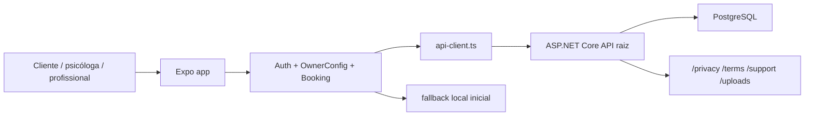
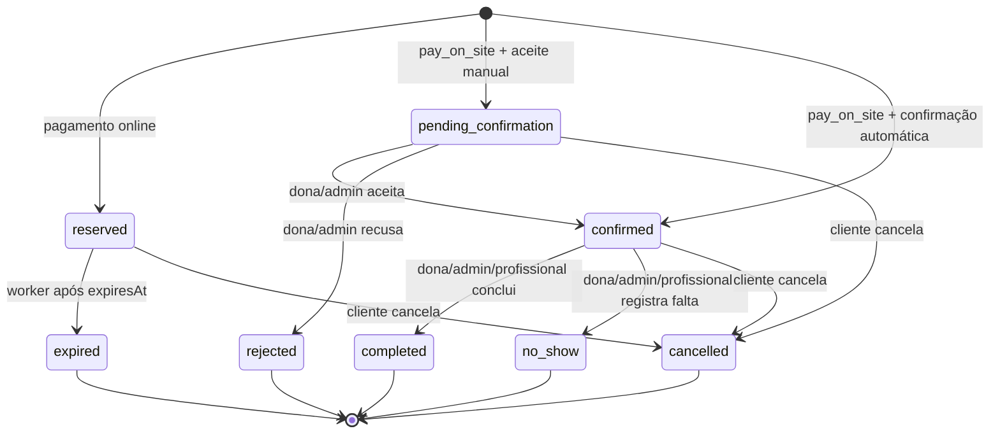

# Fluxo atual do sistema

Atualizado em 2026-06-21.

Este documento transcreve o fluxo do Psi Agenda Online como ele está implementado hoje no app Expo e na API ASP.NET Core.

Fluxogramas dos cenários: `docs/fluxograma-cenarios.md`.

## Visão geral

O sistema é dividido em:

- App Expo SDK 55 com Expo Router em `src/app`.
- Telas reais concentradas em `src/screens`.
- Estado global em `AuthContext`, `OwnerConfigContext` e `BookingContext`.
- API ASP.NET Core em `backend/src/PsiAgenda.Api`.
- Persistência PostgreSQL via Entity Framework Core.
- Dados locais de demonstração em `src/data/initial-owner-config.ts`.

Em produção, o frontend web usa `https://psi.felicio.app` e o app usa `https://api.felicio.app` como raiz da API. O app não deve chamar `/api` em `psi.felicio.app` nem acrescentar `/api` ao domínio da API. As páginas legais públicas do backend ficam em `https://api.felicio.app/privacy`, `/terms` e `/support`.

## Entrada e roteamento

A rota raiz (`src/app/index.tsx`) decide a primeira tela depois de hidratar a sessão:

- Enquanto a sessão hidrata, mostra carregamento.
- `space_admin` ou `space_manager` entra direto no painel da psicóloga.
- Usuário com perfil de atendimento ativo e consultório selecionado entra no painel da psicóloga.
- `professional` entra direto em `ProfessionalAgendaScreen`.
- Usuário autenticado comum entra em `HomeScreen`.
- Visitante web entra em `LandingScreen`.
- Visitante em app nativo também entra em `HomeScreen`.

As rotas em `src/app/*.tsx` são finas: elas só exportam telas de `src/screens`. O layout global envolve tudo nesta ordem:

1. `AuthProvider`
2. `OwnerConfigProvider`
3. `BookingProvider`
4. `Stack` do Expo Router sem header padrão

## Sessão e autenticação

O app guarda `access_token` e `refresh_token` em:

- `SecureStore` no nativo.
- `localStorage` na web.

Na abertura do app, `restoreAuthSession()` chama `GET /auth/me`. Se o access token expirar, o cliente tenta `POST /auth/refresh-token` uma vez e repete a chamada original. Se a renovação falhar, limpa a sessão e dispara o aviso de sessão expirada.

Fluxos disponíveis:

- Cadastro de cliente: `POST /auth/register/customer`.
- Cadastro de psicóloga dona/admin: `POST /auth/register/space-admin`.
- Cadastro de profissional vinculada: `POST /auth/register/professional`.
- Login: `POST /auth/login`.
- Logout: `POST /auth/logout` e limpeza local.
- Excluir conta: `DELETE /auth/me`.

Depois do cadastro:

- Cliente vai para `/`.
- Psicóloga dona/admin vai para `/create-space`.
- Profissional vai para `/`.

O botão "continuar como cliente" existe no contrato do contexto, mas hoje lança erro: a cliente precisa criar uma conta para agendar.

## Fluxo público e cliente

### Landing web

Visitante web sem sessão vê `LandingScreen`, com CTAs para:

- Marcar consulta (`/explore`, que usa `HomeScreen`).
- Cadastrar consultório (`/space-owner-register`).
- Entrar (`/login`).
- Páginas legais.

### Catálogo

`HomeScreen` carrega:

- Consultórios publicados por `GET /public/spaces`.
- Agendamentos da cliente por `GET /customers/me/appointments`, se houver usuário.

Se a localização for autorizada, envia latitude/longitude para ordenar por distância. A busca filtra por nome, bairro, cidade e serviços. Favoritos ficam apenas no estado local do app.

Se a API falha, a tela mostra erro, mas o contexto já nasce com os dados locais de demonstração, então o protótipo ainda pode exibir a clínica inicial.

### Detalhe do consultório

Ao abrir um consultório, o app:

1. Salva o `spaceId` no `BookingContext`.
2. Vai para `/space-details`.
3. Busca detalhes em `GET /public/spaces/{spaceId}`.
4. Sincroniza fotos, serviços, profissionais, horários, pagamento e política.

A tela exibe abas de sobre, fotos, consultas, psicólogas e avaliações. O botão "Agendar agora" limpa serviços escolhidos e vai para `/service-selection`.

O botão "Contato" está visível, mas hoje não executa ação real.

### Escolha de consulta

Em `/service-selection`, a cliente escolhe uma ou mais consultas ativas. O app considera apenas serviços:

- Do consultório selecionado.
- Ativos.
- Com `onlineBooking = true`.
- Com preço e duração.
- Vinculados a pelo menos uma profissional ativa.

Ao alterar serviços, o booking limpa profissional, data, horário e agendamento anterior.

### Escolha de psicóloga

Em `/professional-selection`, o app lista apenas profissionais que atendem todos os serviços escolhidos.

Se o consultório permite qualquer profissional, aparece a opção "Qualquer psicóloga disponível". Nesse modo, o backend retorna um horário por início, escolhendo o primeiro encaixe por horário.

### Escolha de horário

Em `/calendar-selection`, o app mostra 5 dias e chama `POST /availability/search`.

Se a API falha, tenta calcular localmente com os dados do contexto. Esse fallback considera funcionamento, agenda da profissional, pausa, bloqueios locais e agendamentos locais.

No backend, a disponibilidade considera:

- Consultório ativo, publicado e com onboarding completo.
- `allowOnlineBooking = true`.
- Serviços ativos e online.
- Soma de duração + buffer de todos os serviços.
- Horário de funcionamento do consultório.
- Agenda da profissional.
- Pausa da profissional.
- Bloqueios do dia.
- Agendamentos confirmados, aguardando confirmação e reservas ainda não expiradas.
- Horários passados no fuso de negócio.
- Grade fixa de 30 minutos.

### Revisão e confirmação

Em `/appointment-review`, a cliente revisa consultório, psicóloga, data, horário, duração, consultas, total e política de cancelamento.

Em `/payment`, o app exige usuário autenticado. Se não houver sessão, mostra CTAs para login ou cadastro de cliente.

A forma de pagamento vem das configurações do consultório:

- `pix`
- `credit_card`
- `debit_card`
- `pay_on_site`

Hoje o pagamento é combinado. Não há integração real com provedor financeiro, Pix, cartão ou webhook.

Na confirmação, o app chama `POST /appointments/reserve`. Se a API falha, tenta criar uma reserva local de demonstração. Se conseguir, segue para sucesso mesmo sem persistir na API.

### Resultado da reserva

O status inicial depende da forma de pagamento e da configuração de confirmação manual:

- `pix`, `credit_card` ou `debit_card`: backend cria `reserved` com `paymentStatus = pending` e `expiresAt`. No app, `reserved` é mapeado para `pending_payment`.
- `pay_on_site` com confirmação manual: cria `pending_confirmation`.
- `pay_on_site` sem confirmação manual: cria `confirmed` e já gera `onlineRoomUrl`.

Reservas `reserved` expiram automaticamente por worker a cada minuto. Quando expiram, viram `expired` e `paymentStatus = failed`.

Em `/booking-success`, a cliente vê:

- "Aguardando aceite" para `pending_confirmation`.
- "Aguardando pagamento" para `pending_payment`.
- "Agendamento confirmado" para `confirmed`.

As ações rápidas "Adicionar", "Compartilhar" e "Contato" aparecem na tela de sucesso, mas hoje não têm ação real.

## Pós-agendamento da cliente

Na aba "Meus agendamentos" ou nos próximos agendamentos, a cliente abre `/appointment-details`.

Essa tela chama `GET /customers/me/appointments/{appointmentId}` e permite:

- Entrar na sala online se o status for `confirmed` e existir `onlineRoomUrl`.
- Reagendar se o status estiver em `confirmed`, `pending_payment` ou `pending_confirmation`.
- Cancelar nesses mesmos status.
- Avaliar quando o status for `completed` e ainda não houver avaliação.

Cancelamento:

- Chama `POST /customers/me/appointments/{id}/cancel`.
- Só funciona se a política permitir cancelamento pela cliente.
- Não permite alterar agendamentos cancelados, expirados, concluídos, falta ou recusados.
- Não permite alterar agendamentos passados.
- Registra auditoria e notifica cliente e dona/admin.

Reagendamento:

- Chama `POST /customers/me/appointments/{id}/reschedule`.
- Só funciona se a política permitir reagendamento.
- Recalcula disponibilidade para os mesmos serviços.
- Atualiza profissional, data e horário.
- Registra auditoria e notifica cliente e dona/admin.

Avaliação:

- Chama `POST /customers/me/appointments/{id}/review`.
- Nota de 1 a 5.
- Só depois de `completed`.
- Apenas uma avaliação por agendamento.

## Fluxo da psicóloga dona/admin

### Criação de consultório

A conta `space_admin` entra em `/create-space`. A tela coleta:

- Nome.
- Descrição.
- Telefone.
- WhatsApp.
- CEP, endereço, bairro, cidade e UF.
- Categoria.
- Localização atual opcional.

O CEP usa ViaCEP. A localização usa `expo-location`.

Ao salvar, chama `POST /spaces`. O backend:

- Cria o consultório ativo, ainda não publicado.
- Vincula a usuária como `SpaceAdmin`.
- Cria configurações padrão de pagamento.
- Cria política padrão de cancelamento.
- Cria configurações padrão de notificação.
- Registra auditoria.

Depois o app abre `/owner-onboarding-checklist`.

### Checklist inicial

O checklist exigido para publicação é:

1. Dados básicos do consultório.
2. Pelo menos 1 consulta ativa e online.
3. Pelo menos 1 psicóloga/profissional ativa.
4. Serviços vinculados a profissionais.
5. Horário de funcionamento.
6. Agenda da profissional.
7. Forma de pagamento configurada.
8. Política de cancelamento.

Enquanto faltam itens, o botão principal leva para a próxima tela necessária. Quando todos completam, `finishOwnerSetup()` chama `POST /spaces/{spaceId}/starter-setup`.

Ao finalizar:

- Backend marca `Published = true`.
- Backend marca `OnboardingCompleted = true`.
- App sincroniza consultório, serviços e profissionais.
- App ativa o perfil de atendimento para essa conta.
- App volta para `/`, que passa a abrir o painel da psicóloga.

O backend também roda `SyncPublicationAsync` em algumas atualizações: se o checklist ficar completo, publica; se deixar de ficar completo, despublica.

### Gestão do consultório

O painel (`OwnerDashboardScreen`) carrega:

- Consultórios por `GET /spaces/my`, se ainda não houver um selecionado.
- Métricas por `GET /spaces/{spaceId}/dashboard`.

Ele mostra:

- Agendamentos do dia.
- Receita estimada.
- Consultas ativas.
- Psicólogas ativas.
- Status do checklist/publicação.
- Atalhos de gestão.
- Menu para trocar consultório, criar consultório, ativar perfil de atendimento, ir para agenda profissional, páginas legais, sair e excluir conta.

Telas de gestão e chamadas principais:

- Consultas: `GET/POST /spaces/{spaceId}/services`.
- Psicólogas: `GET/POST /spaces/{spaceId}/professionals`.
- Funcionamento: `GET/PUT /spaces/{spaceId}/opening-hours`.
- Agenda da psicóloga: `GET/PUT /spaces/{spaceId}/professionals/{professionalId}/schedule`.
- Configurações de agendamento: `GET/PUT /spaces/{spaceId}/booking-settings`.
- Pagamento: `GET/PUT /spaces/{spaceId}/payment-settings`.
- Política de cancelamento: `GET/PUT /spaces/{spaceId}/cancellation-policy`.
- Bloqueios: `GET/POST/DELETE /spaces/{spaceId}/blocked-times`.
- Fotos: `GET/POST/POST upload/DELETE /spaces/{spaceId}/photos`.
- Notificações: `GET/PUT /spaces/{spaceId}/notification-settings`.

As telas carregam da API, sincronizam o contexto local e exibem mensagem quando a API falha. A maior parte da gestão não tem fallback local completo para persistência.

### Agenda da dona/admin

`/owner-agenda` chama `GET /spaces/{spaceId}/appointments`, mostra calendário por dia, semana ou mês e calcula:

- Receita do período.
- Reservas aguardando pagamento.
- Pedidos aguardando confirmação.

A dona/admin pode:

- Abrir detalhe do pedido.
- Aceitar pedido `pending_confirmation`.
- Marcar atendimento como concluído.
- Registrar falta.
- Criar bloqueio.
- Abrir configurações de notificação.

No detalhe (`/owner-appointment-details`), a dona/admin pode:

- Ver cliente, contato, consultório, psicóloga, data, horário, valor, status e serviços.
- Entrar na sala online quando o agendamento estiver confirmado.
- Aceitar pedido aguardando confirmação.
- Recusar pedido aguardando confirmação com motivo de 3 a 500 caracteres.

Aceitar pedido:

- Só funciona para `pending_confirmation`.
- Muda para `confirmed`.
- Cria `onlineRoomUrl` se ainda não existir.
- Notifica cliente e profissional se configurado.

Recusar pedido:

- Só funciona para `pending_confirmation`.
- Muda para `rejected`.
- Salva motivo e data da decisão.
- Remove sala online.
- Notifica cliente se configurado.

Concluir/falta:

- Não funciona para cancelado, expirado ou recusado.
- Não funciona se já estiver concluído ou falta.
- Não funciona para `pending_confirmation`; precisa confirmar antes.

## Fluxo da profissional vinculada

A rota de profissional é `/professional-agenda`.

O acesso depende de a usuária existir e o e-mail dela estar vinculado a uma profissional ativa em algum consultório. O backend busca uma profissional ativa com `Professional.Email == User.Email`.

A tela:

- Ativa localmente o perfil de atendimento se ainda não estiver ativo.
- Carrega `GET /professionals/me/appointments`.
- Filtra os atendimentos do dia selecionado.
- Permite abrir a sala se o agendamento estiver `confirmed` e tiver `onlineRoomUrl`.
- Permite concluir ou registrar falta.
- Permite criar bloqueio em sua agenda por `POST /professionals/me/blocked-times`.
- Permite logout, páginas legais e exclusão de conta.

Profissional não confirma nem recusa pedidos. Pedidos `pending_confirmation` precisam de ação da dona/admin.

## Status de agendamento

Status atuais usados entre backend e app:

- `reserved`: reserva criada aguardando pagamento online. O app mostra como `pending_payment`.
- `pending_payment`: usado no app/local para pendência de pagamento.
- `pending_confirmation`: aguardando aceite da dona/admin.
- `confirmed`: agendamento confirmado e elegível para sala online.
- `expired`: reserva expirada.
- `cancelled`: cancelado pela cliente.
- `completed`: atendimento concluído.
- `no_show`: falta registrada.
- `rejected`: recusado pela dona/admin.

Observação atual: listas sincronizadas pelo `OwnerConfigContext` convertem `reserved` para `pending_payment`, mas algumas telas de detalhe consomem a resposta crua da API. Na prática, uma reserva `reserved` pode aparecer como "Reservado" no detalhe e não liberar as mesmas ações que a tela espera para `pending_payment`.

Transições principais:

## Notificações

Notificações são registros internos no banco. Hoje não há push notification, e-mail ou WhatsApp integrado.

São criadas para:

- Cliente ao agendar, cancelar, reagendar, confirmar, concluir ou registrar falta.
- Dona/admin ao receber agendamento, cancelamento, reagendamento e avaliação.
- Profissional quando houver atendimento confirmado, se existir usuária com o mesmo e-mail da profissional.

Endpoints:

- `GET /notifications`.
- `POST /notifications/{notificationId}/read`.

## Fotos e arquivos

Fotos do consultório podem ser:

- Criadas por URL.
- Enviadas como multipart em `/spaces/{spaceId}/photos/upload`.

Upload aceita JPG, PNG e WEBP até 8 MB. O backend salva em `wwwroot/uploads/spaces/{spaceId}` e gera uma URL pública com base no host da requisição.

## Dados principais

Entidades principais:

- `User`
- `RefreshToken`
- `Space`
- `SpaceUser`
- `ServiceCategory`
- `Service`
- `Professional`
- `ProfessionalService`
- `ProfessionalSchedule`
- `SpaceOpeningHour`
- `BlockedTime`
- `SpacePaymentSettings`
- `SpaceCancellationPolicy`
- `SpaceNotificationSettings`
- `SpacePhoto`
- `Appointment`
- `AppointmentService`
- `Notification`
- `Review`
- `AuditLog`

Relações centrais:

- Usuário administra consultórios por `SpaceUser`.
- Consultório tem serviços, profissionais, horários, bloqueios, fotos, políticas e configurações.
- Profissional atende serviços por `ProfessionalService`.
- Profissional tem agenda semanal por `ProfessionalSchedule`.
- Agendamento liga cliente, consultório, profissional e serviços escolhidos.
- Avaliação pertence a um agendamento concluído.
- Notificações podem pertencer a usuário, consultório e agendamento.
- Auditoria registra ações relevantes de criação, alteração e decisão.

## Limitações atuais

- Não existe integração real de pagamento. Pix/cartão ficam como pagamento combinado e reservas online expiram se nada mudar o status.
- Não existe endpoint atual para marcar pagamento como pago.
- Notificações são internas; não há push, e-mail ou WhatsApp.
- Favoritos são estado local, não persistidos por usuário.
- Algumas ações visíveis ainda são placeholders: contato no detalhe, ações rápidas de sucesso.
- O fallback local cobre principalmente catálogo inicial, cálculo de disponibilidade e criação local de reserva de demonstração. Gestão, pós-agendamento e profissional dependem da API.
- `super_admin` existe no tipo de papel, mas hoje não tem tela dedicada no app.
- Profissional é vinculada por e-mail; se o e-mail não estiver cadastrado em uma profissional ativa, a agenda profissional retorna erro.
- A nomenclatura interna ainda mistura `space`, `espaço`, `consultório`, `professional` e `psicóloga`, embora a experiência visível esteja adaptada para psicologia.

## Arquivos de referência

- `src/app/index.tsx`: decisão da tela inicial por sessão e papel.
- `src/app/_layout.tsx`: providers globais e stack.
- `src/contexts/AuthContext.tsx`: sessão, login, cadastro e perfil de atendimento.
- `src/contexts/BookingContext.tsx`: estado do fluxo de agendamento.
- `src/contexts/OwnerConfigContext.tsx`: catálogo local, sincronização da API, fallback e mapeamentos.
- `src/services/api-client.ts`: raiz da API, tokens, refresh e endpoints do app.
- `src/screens/HomeScreen.tsx`: catálogo, abas da cliente e perfil.
- `src/screens/BookingFlowScreens.tsx`: horário, revisão, pagamento e sucesso.
- `src/screens/OwnerScreens.tsx`: criação de consultório, checklist e painel.
- `src/screens/OwnerManagementScreens.tsx`: gestão operacional do consultório.
- `src/screens/ProfessionalScreens.tsx`: agenda da profissional vinculada.
- `backend/src/PsiAgenda.Api/Program.cs`: middleware, CORS, auth, `/health` e endpoints.
- `backend/src/PsiAgenda.Api/Endpoints/AuthEndpoints.cs`: autenticação.
- `backend/src/PsiAgenda.Api/Endpoints/SpaceEndpoints.cs`: consultórios, público, agendamentos, profissional e notificações.
- `backend/src/PsiAgenda.Infrastructure/Services/AuthService.cs`: regras de sessão e conta.
- `backend/src/PsiAgenda.Infrastructure/Services/SpaceService.cs`: regras de consultório, disponibilidade, reserva e agenda.
- `backend/src/PsiAgenda.Infrastructure/Persistence/PsiAgendaDbContext.cs`: modelo relacional.
