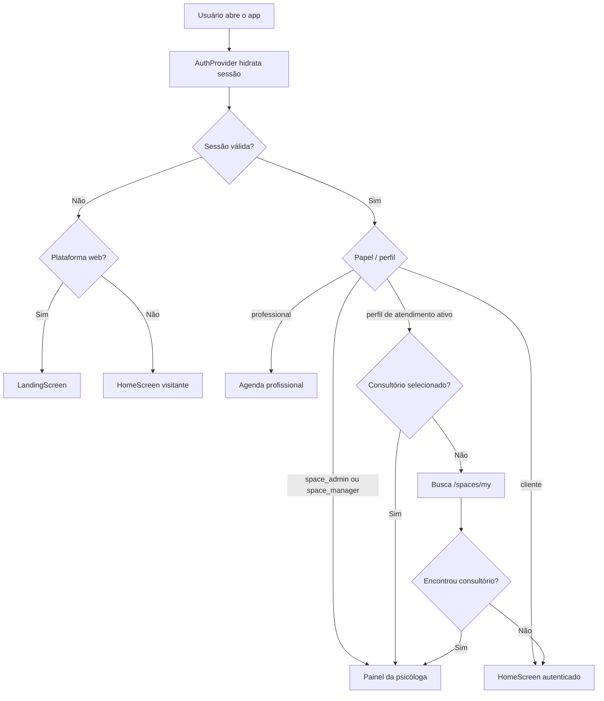
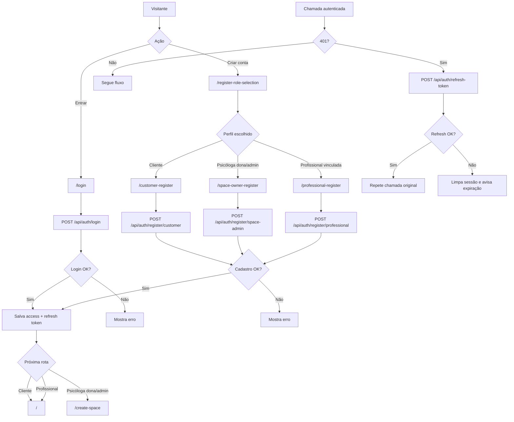
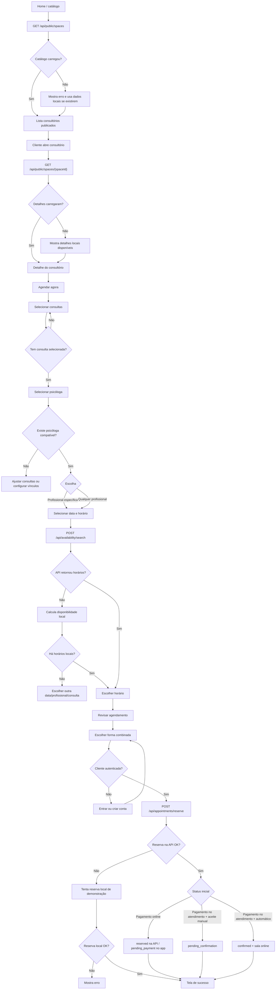
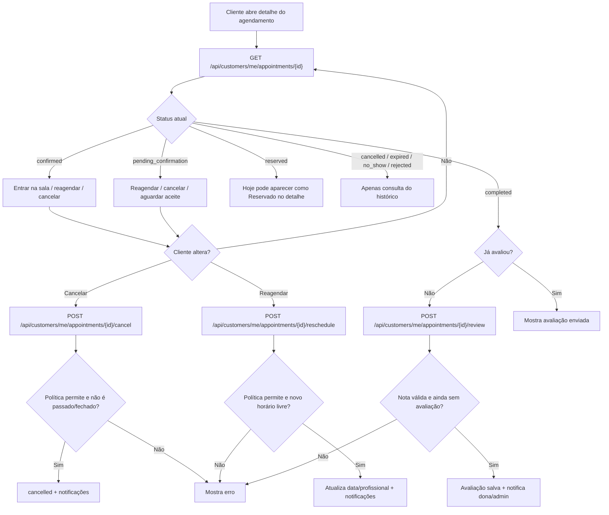
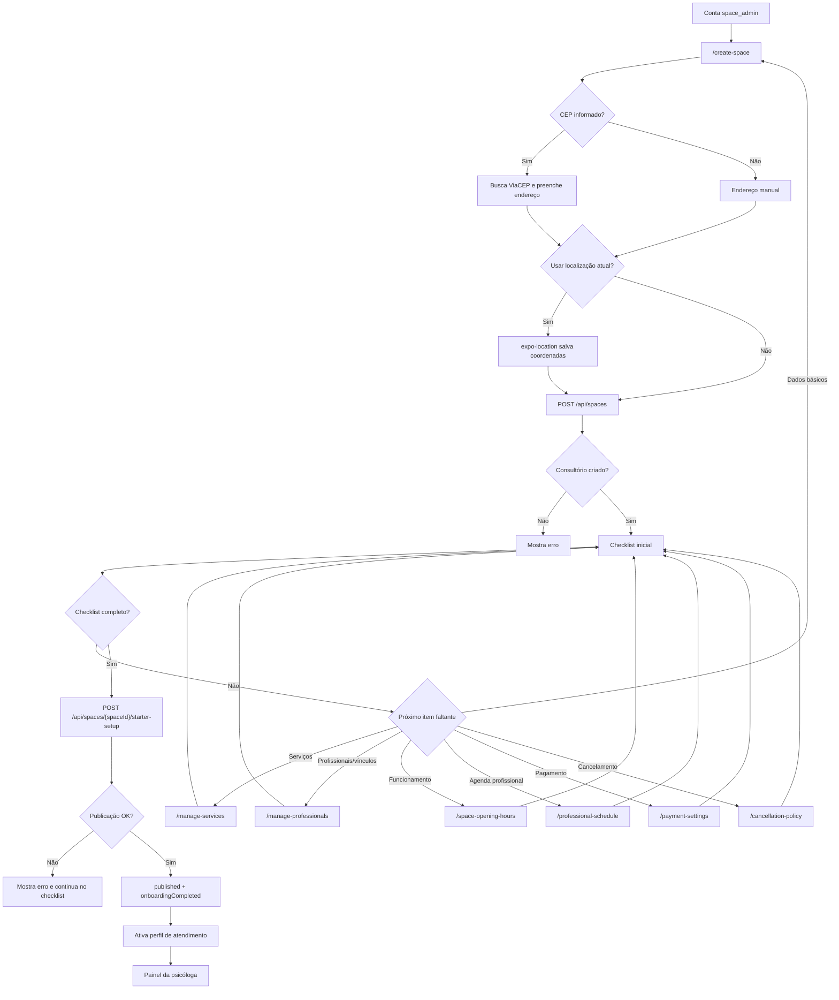
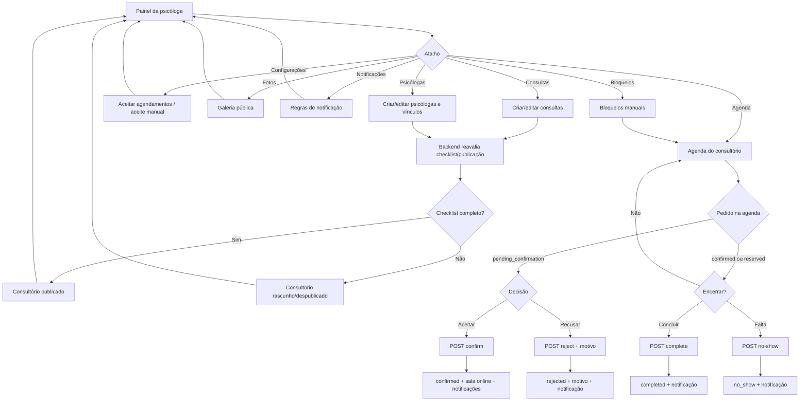
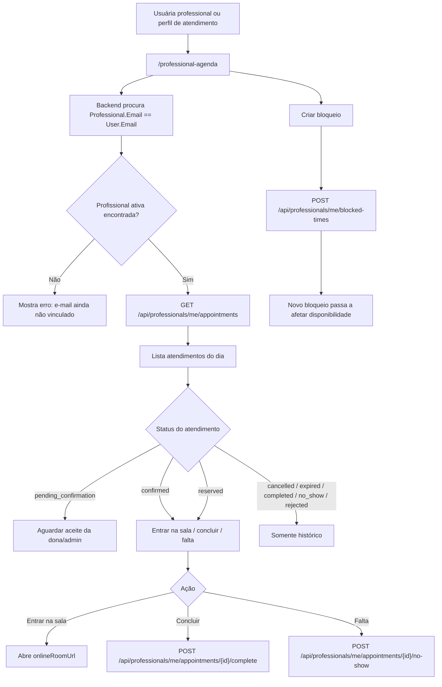
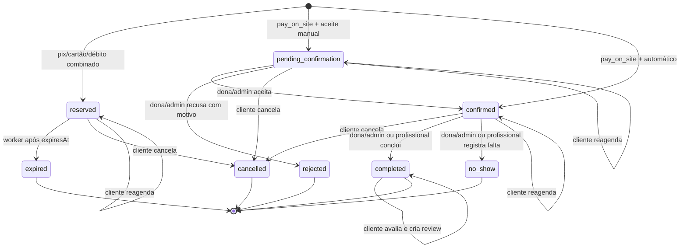
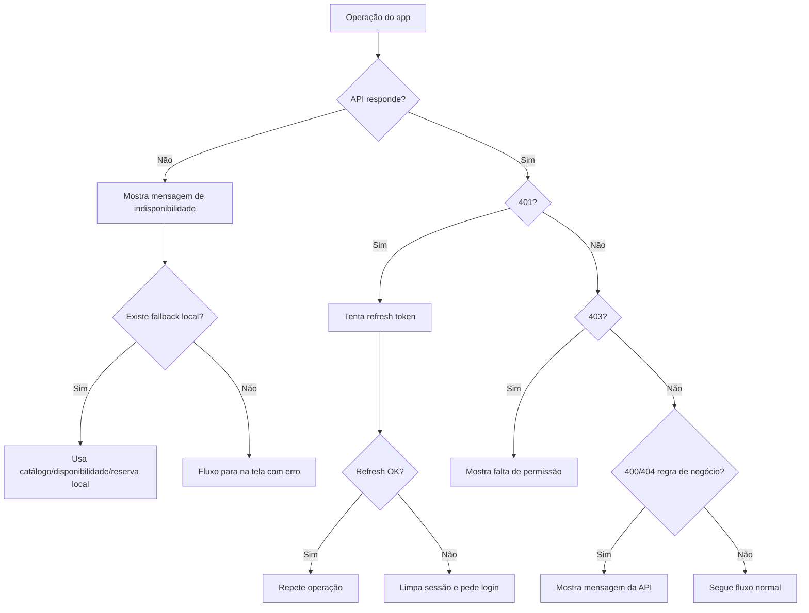

# Fluxograma dos cenários possíveis

Atualizado em 2026-06-21.

Este documento resume os caminhos possíveis do sistema atual em Mermaid. Ele complementa `docs/fluxo-sistema-atual.md`.

## 1. Entrada no app

## 2. Cadastro, login e sessão expirada

## 3. Fluxo de agendamento da cliente

## 4. Cenários depois do agendamento

## 5. Onboarding e publicação da psicóloga dona/admin

## 6. Gestão do consultório e agenda da dona/admin

## 7. Profissional vinculada por e-mail

## 8. Estados do agendamento

## Cenários de erro mais comuns

